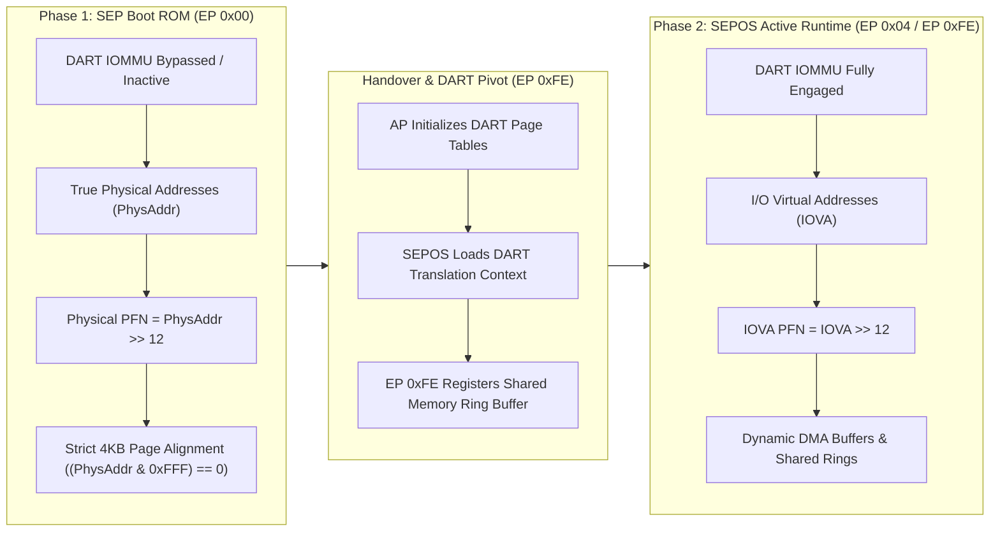
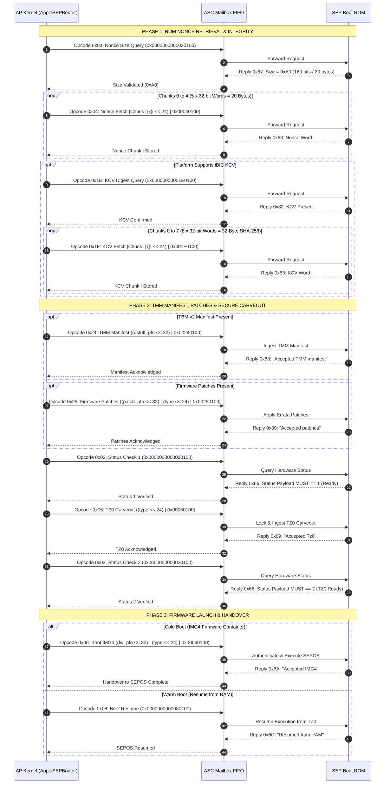
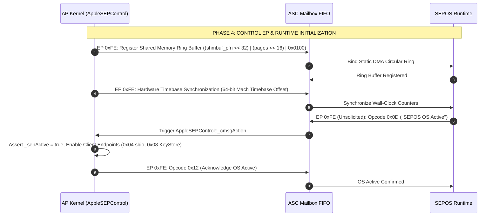

# 02. Secure Enclave Processor (SEP) Boot ROM Sequence Specification

## Executive Summary

The Apple Silicon Secure Enclave Processor (SEP) boots through a hardware-enforced sequence over the Apple System Coprocessor (ASC) mailbox. Starting the SEP involves a multi-step cryptographic handshake: it validates hardware authenticity, exchanges anti-replay nonces, configures a hardware-isolated DRAM carveout (TZ0), verifies authenticated firmware containers (IMG4), and switches from raw physical memory addressing to IOMMU-based DMA before enabling runtime services (including Touch ID via `sbio`).

This document details the complete 10-step SEP Boot ROM protocol on Endpoint `0x00` and the post-boot handover sequence on Control Endpoint `0xFE`. All data structures, opcodes, state transitions, and memory rules described here have been verified against the Apple Silicon ARM64e kernel collection (`/tmp/kernel.kc`) following Asahi Linux clean-room standards.

---

## 1. Hardware Architecture & Addressing Modes

### 1.1 The Dual-Register ASC Mailbox Hardware Interface

The Application Processor (AP) and the SEP communicate using memory-mapped FIFO registers in the ASC mailbox MMIO region (`0x396408000`). Every mailbox transmission is a 128-bit hardware packet split across two registers:

* **`msg0` (64-bit register)**: Carries the operational payload (Physical PFN / IOVA), parameter bytes, command opcode, sequence tag, and reserved padding.
* **`msg1` (32-bit register)**: Carries the target Endpoint ID in bits `[7:0]` and subsystem routing flags in bits `[31:8]`.

```
                AP-to-SEP Hardware Mailbox Write Registers (Tx)
               =================================================
  Register: msg0 (64-bit MMIO @ Offset 0x8800)
   63                                32 31           24 23           16 15            8 7              0
  +------------------------------------+---------------+---------------+---------------+---------------+
  |        Data Payload / PFN          |     Param     |  Boot Opcode  | Sequence/Tag  |   Reserved    |
  |         (phys_addr >> 12)          | (Chunk/Type)  | (e.g. 0x03)   |    (0x01)     |    (0x00)     |
  |             (32 bits)              |   (8 bits)    |   (8 bits)    |   (8 bits)    |   (8 bits)    |
  +------------------------------------+---------------+---------------+---------------+---------------+

  Register: msg1 (32-bit MMIO @ Offset 0x8808)
   31                                                                 8 7                              0
  +--------------------------------------------------------------------+-------------------------------+
  |                           Subsystem Flags                          |          Endpoint ID          |
  |                         (0x000000 = Standard)                      |          (0x00 / 0xFE)        |
  +--------------------------------------------------------------------+-------------------------------+
```

```
                SEP-to-AP Hardware Mailbox Read Registers (Rx)
               =================================================
  Register: msg0 (64-bit MMIO @ Offset 0x8830)
   63                                32 31           24 23           16 15            8 7              0
  +------------------------------------+---------------+---------------+---------------+---------------+
  |         Reply Data Payload         |   Reserved    |  Reply Opcode | Sequence/Tag  |   Reserved    |
  |     (Status / Nonce / Hash Word)   |     (0x00)    | (e.g. 0x67)   |    (0x01)     |    (0x00)     |
  |             (32 bits)              |   (8 bits)    |   (8 bits)    |   (8 bits)    |   (8 bits)    |
  +------------------------------------+---------------+---------------+---------------+---------------+

  Register: msg1 (32-bit MMIO @ Offset 0x8838)
   31                                                                 8 7                              0
  +--------------------------------------------------------------------+-------------------------------+
  |                           Subsystem Flags                          |          Endpoint ID          |
  |                         (0x000000 = Standard)                      |          (0x00 / 0xFE)        |
  +--------------------------------------------------------------------+-------------------------------+
```

---

### 1.2 The DART Memory Pivot Constraint

A key rule in SEP memory management is the architectural boundary between early Boot ROM mode and the active SEPOS runtime:



1. **Phase 1 (Boot ROM / Endpoint `0x00`)**:
   * The DART (Device Address Resolution Table) IOMMU for SEP DMA is uninitialized or running in bypass mode.
   * All buffers passed to the SEP Boot ROM (TMM Manifest, Firmware Patches, and Firmware IMG4) **must use raw physical memory addresses converted to Page Frame Numbers (PFNs)**:
     $$\text{PFN} = \frac{\text{Physical Base Address}}{4096} = \text{PhysAddr} \gg 12$$
   * All buffers must be strictly 4KB page-aligned: `(PhysAddr & 0xFFF) == 0`. Passing an unaligned address triggers an immediate kernel assertion or SEP bus abort (verified at `0xfffffe00099bbce8` in `AppleSEPBooter::bootSEP`).

2. **Phase 2 (SEPOS Active Runtime / Endpoints `0x04`, `0x08`, `0xFE`)**:
   * After firmware verification and handover, SEPOS enables its MMU and requires all DMA traffic to go through the DART IOMMU.
   * All runtime client buffers (such as `IOBioSEPSharedBuffer` used by `AppleMesaSEPDriver` for Touch ID frame capture via Opcode `0x65`) **must use DART-mapped I/O Virtual Addresses (IOVA)**.

---

### 1.3 TZ0 Secure DRAM Carveout Architecture

The SEP uses a dedicated, persistent DRAM carveout called **TZ0** (TrustZone 0 / Secure Memory Carveout) to hold the SEPOS kernel, cryptographic key stores, and persistent catacomb structures:

```
  +-------------------------------------------------------------------------+
  |                          System Physical DRAM                           |
  |  +----------------------------------+--------------------------------+  |
  |  |       AP OS Memory (Linux)       |      TZ0 DRAM Carveout         |  |
  |  |       (Non-Secure Domain)        |      (SEP Secure Domain)       |  |
  |  +----------------------------------+--------------------------------+  |
  +-------------------------------------------------------------------------+
                                          ^
                                          | Hardware Firewall Enforced
  +-------------------------------------------------------------------------+
  |                   Apple Memory Controller (AMC) MMIO                    |
  |   - Registers configured & one-way locked by m1n1 Stage 2 bootloader    |
  |   - AP read/write access to TZ0 DRAM range is hard-blocked in silicon   |
  |   - SEP Boot ROM validates TZ0 lock status before accepting Opcode 0x05 |
  +-------------------------------------------------------------------------+
```

* **Hardware Protection**: TZ0 protection is enforced by the Apple Memory Controller (AMC) hardware firewall. Once the TZ0 base address, size, and protection masks are programmed into the AMC MMIO registers, a hardware lock bit is set. This lock bit is a **one-way hardware latch** that cannot be cleared until the SoC undergoes a cold reset.
* **Bootloader Responsibility**: The Asahi Linux bootloader (`m1n1` / Stage 2) configures and locks the TZ0 AMC carveout before jumping to the Linux kernel.
* **Kernel Driver Role**: The Linux driver does not allocate or touch the TZ0 memory directly. Instead, it sends Opcode `0x05` (`BootTz0`) over the mailbox to inform the SEP Boot ROM that the TZ0 carveout is established. The Boot ROM verifies the AMC hardware lock status and returns an acknowledgment.

---

## 2. The 10-Step Boot ROM Sequence Message Ledger (Endpoint `0x00`)

Every transaction on Endpoint `0x00` uses a synchronous request-reply model: the AP writes a 64-bit command message to `msg0` (with `msg1 = 0x00000000`), sets the in-flight flag, rings the mailbox doorbell, and waits for a response from the SEP (routed to Endpoint `0x00` or legacy `0xFF`).



---

### 2.1 Complete Ledger of Endpoint `0x00` Mailbox Operations

| Step | Operation Name | Opcode (AP $\to$ SEP) | Param (`[31:24]`) | Data Payload (`[63:32]`) | Reply Opcode | Expected Reply Data | Mandatory Assertions & Failure Rules |
|:---:|:---|:---:|:---:|:---|:---:|:---|:---|
| **1** | **ROM Nonce Size Query** | `0x03` | `0x00` | `0x00000000` | `0x67` | `0x000000A0` (160 bits / 20 bytes) | Reply opcode must equal `0x67` and size must equal `0xA0`. If invalid, abort boot. |
| **2** | **ROM Nonce Fetch** (5 Chunks) | `0x04` | `0x00` .. `0x04` | `0x00000000` | `0x68` | 32-bit chunk `nonce[i]` | Reply opcode must equal `0x68`. Assembles 20-byte anti-replay nonce for IMG4 verification. |
| **3** | **iBIC KCV Digest Query** | `0x1E` | `0x00` | `0x00000000` | `0x82` | `0x00000000` | If platform lacks iBIC or returns `0xC7`, skip KCV fetch. |
| **4** | **iBIC KCV Fetch** (8 Chunks) | `0x1F` | `0x00` .. `0x07` | `0x00000000` | `0x83` | 32-bit chunk `kcv[i]` | Reply opcode must equal `0x83`. Assembles 32-byte SHA-256 Key Confirmation Value. |
| **5** | **TMM Manifest Upload** | `0x24` | `0x00` | `ustuff_pfn` (`PhysAddr >> 12`) | `0x88` | `"Accepted TMM manifest"` | Buffer must be 4KB aligned: `(PhysAddr & 0xFFF) == 0`. |
| **6** | **Firmware Patches Upload** | `0x25` | `fw_type` | `patch_pfn` (`PhysAddr >> 12`) | `0x89` | `"Accepted patches"` | Buffer must be 4KB aligned. |
| **7** | **Status Check 1** | `0x02` | `0x00` | `0x00000000` | `0x66` | **MUST strictly equal `1`** | Bits `[63:32]` must equal `1` (`Ready`). Any other value triggers a fatal boot panic. |
| **8** | **TZ0 Carveout Notification** | `0x05` | `fw_type` | `0x00000000` | `0x69` | `"Accepted Tz0"` | AMC DRAM carveout must be locked prior to transmission. |
| **9** | **Status Check 2** | `0x02` | `0x00` | `0x00000000` | `0x66` | **MUST strictly equal `2`** | Bits `[63:32]` must equal `2` (`TZ0 Ready`). Any other value triggers a fatal boot panic. |
| **10A**| **Boot IMG4 (Cold Boot)** | `0x06` | `fw_type` | `fw_pfn` (`PhysAddr >> 12`) | `0x6A` | `"Accepted IMG4"` | Firmware container must be 4KB aligned. Signals SEPOS execution entry. |
| **10B**| **Boot Resume (Warm Wake)**| `0x08` | `0x00` | `0x00000000` | `0x6C` | `"Resumed from RAM"` | Restores SEP execution state from persistent TZ0 DRAM. |

---

## 3. Bitfield Wire Encodings for Every Boot Step

All outgoing mailbox commands are formatted into `msg0` and `msg1` using Format A (Boot & Control):

$$\text{msg0} = (\text{Payload} \ll 32) \mid (\text{Param} \ll 24) \mid (\text{Opcode} \ll 16) \mid (\text{Tag} \ll 8)$$
$$\text{msg1} = \text{Endpoint}$$

Here, `Tag = 0x01` and `msg0[7:0]` is strictly reserved padding (`0x00`). The destination `Endpoint` (`0x00` for Boot ROM or `0xFE` for Control) resides exclusively in `msg1[7:0]`.

---

### Step 1: ROM Nonce Size Query
Queries the length in bits of the hardware anti-replay nonce generated by the SEP Boot ROM.

* **Outgoing Wire Registers (AP $\to$ SEP)**:
  * `msg0`: `0x0000000000030100`
    * Bits `[63:32]`: `0x00000000` (Data Payload)
    * Bits `[31:24]`: `0x00` (Param)
    * Bits `[23:16]`: `0x03` (Opcode: `kSEPOpcodeGetNonceSize`)
    * Bits `[15:8]`: `0x01` (Tag)
    * Bits `[7:0]`: `0x00` (Reserved / Padding)
  * `msg1`: `0x00000000`
* **Expected Reply Registers (SEP $\to$ AP)**:
  * `msg0`: `0x000000A000670100`
    * Bits `[63:32]`: `0x000000A0` (160 bits = 20 bytes)
    * Bits `[23:16]`: `0x67` (Reply Opcode: `kSEPReplyNonceSize`)
  * `msg1`: `0x00000000`

---

### Step 2: ROM Nonce Fetch (Chunks 0..4)
Reads 4-byte chunks of the 20-byte anti-replay nonce across 5 iterations using chunk index $i \in [0..4]$.

* **Outgoing Wire Registers (AP $\to$ SEP for Chunk $i$)**:
  * `msg0`: `(uint64_t)i << 24 | 0x00040100`
    * Chunk 0: `0x0000000000040100`
    * Chunk 1: `0x0000000001040100`
    * Chunk 2: `0x0000000002040100`
    * Chunk 3: `0x0000000003040100`
    * Chunk 4: `0x0000000004040100`
    * Bits `[63:32]`: `0x00000000`
    * Bits `[31:24]`: `i` (Chunk Index $0..4$)
    * Bits `[23:16]`: `0x04` (Opcode: `kSEPOpcodeGetNonceChunk`)
    * Bits `[15:8]`: `0x01` (Tag)
    * Bits `[7:0]`: `0x00` (Reserved / Padding)
  * `msg1`: `0x00000000`
* **Expected Reply Registers (SEP $\to$ AP)**:
  * `msg0`: `((uint64_t)nonce_word[i] << 32) | 0x00680100`
    * Bits `[63:32]`: `nonce_word[i]` (32-bit nonce segment)
    * Bits `[23:16]`: `0x68` (Reply Opcode: `kSEPReplyNonceChunk`)
  * `msg1`: `0x00000000`

---

### Step 3: iBIC KCV Digest Query
Checks whether the integrated Boot Integrity Controller (iBIC) Key Confirmation Value is supported and present.

* **Outgoing Wire Registers (AP $\to$ SEP)**:
  * `msg0`: `0x00000000001E0100`
    * Bits `[63:32]`: `0x00000000`
    * Bits `[31:24]`: `0x00`
    * Bits `[23:16]`: `0x1E` (Opcode: `kSEPOpcodeQueryiBICKCV`)
    * Bits `[15:8]`: `0x01` (Tag)
    * Bits `[7:0]`: `0x00` (Reserved / Padding)
  * `msg1`: `0x00000000`
* **Expected Reply Registers (SEP $\to$ AP)**:
  * `msg0`: `0x0000000000820100`
    * Bits `[63:32]`: `0x00000000`
    * Bits `[23:16]`: `0x82` (Reply Opcode: `kSEPReplyReportiBICKey`)
  * `msg1`: `0x00000000`

---

### Step 4: iBIC KCV Fetch (Chunks 0..7)
Retrieves the 32-byte SHA-256 Key Confirmation Value across 8 consecutive 4-byte chunk requests ($i \in [0..7]$).

* **Outgoing Wire Registers (AP $\to$ SEP for Chunk $i$)**:
  * `msg0`: `(uint64_t)i << 24 | 0x001F0100`
    * Chunk 0: `0x00000000001F0100` ... Chunk 7: `0x00000000071F0100`
    * Bits `[63:32]`: `0x00000000`
    * Bits `[31:24]`: `i` (Chunk Index $0..7$)
    * Bits `[23:16]`: `0x1F` (Opcode: `kSEPOpcodeFetchiBICKCV`)
    * Bits `[15:8]`: `0x01` (Tag)
    * Bits `[7:0]`: `0x00` (Reserved / Padding)
  * `msg1`: `0x00000000`
* **Expected Reply Registers (SEP $\to$ AP)**:
  * `msg0`: `((uint64_t)kcv_word[i] << 32) | 0x00830100`
    * Bits `[63:32]`: `kcv_word[i]` (32-bit SHA-256 digest word)
    * Bits `[23:16]`: `0x83` (Reply Opcode: `kSEPReplyiBICKCVChunk`)
  * `msg1`: `0x00000000`

---

### Step 5: TMM Manifest Upload
Uploads the physical Page Frame Number of the Trusted Management Module (TMM) / TBM v2 manifest.

* **Outgoing Wire Registers (AP $\to$ SEP)**:
  * `msg0`: `((uint64_t)ustuff_pfn << 32) | 0x00240100`
    * Bits `[63:32]`: `ustuff_pfn` (`ustuff_phys_addr >> 12`)
    * Bits `[31:24]`: `0x00`
    * Bits `[23:16]`: `0x24` (Opcode: `kSEPOpcodeBootTmmManifest`)
    * Bits `[15:8]`: `0x01` (Tag)
    * Bits `[7:0]`: `0x00` (Reserved / Padding)
  * `msg1`: `0x00000000`
* **Expected Reply Registers (SEP $\to$ AP)**:
  * `msg0`: `0x0000000000880100`
    * Bits `[23:16]`: `0x88` (Reply Opcode: `kSEPReplyAcceptedTmmManifest`)
  * `msg1`: `0x00000000`

---

### Step 6: Firmware Patches Upload
Uploads the physical Page Frame Number of the SEPROM errata patch buffer.

* **Outgoing Wire Registers (AP $\to$ SEP)**:
  * `msg0`: `((uint64_t)patch_pfn << 32) | ((uint64_t)fw_type << 24) | 0x00250100`
    * Bits `[63:32]`: `patch_pfn` (`patch_phys_addr >> 12`)
    * Bits `[31:24]`: `fw_type` (Firmware type identifier)
    * Bits `[23:16]`: `0x25` (Opcode: `kSEPOpcodeBootPatch`)
    * Bits `[15:8]`: `0x01` (Tag)
    * Bits `[7:0]`: `0x00` (Reserved / Padding)
  * `msg1`: `0x00000000`
* **Expected Reply Registers (SEP $\to$ AP)**:
  * `msg0`: `0x0000000000890100`
    * Bits `[23:16]`: `0x89` (Reply Opcode: `kSEPReplyAcceptedPatches`)
  * `msg1`: `0x00000000`

---

### Step 7: Status Check 1
Confirms that the SEP Boot ROM has accepted all pre-boot data and is ready for TZ0 DRAM configuration.

* **Outgoing Wire Registers (AP $\to$ SEP)**:
  * `msg0`: `0x0000000000020100`
    * Bits `[63:32]`: `0x00000000`
    * Bits `[31:24]`: `0x00`
    * Bits `[23:16]`: `0x02` (Opcode: `kSEPOpcodeStatusCheck`)
    * Bits `[15:8]`: `0x01` (Tag)
    * Bits `[7:0]`: `0x00` (Reserved / Padding)
  * `msg1`: `0x00000000`
* **Expected Reply Registers (SEP $\to$ AP)**:
  * `msg0`: `0x0000000100660100`
    * Bits `[63:32]`: **`0x00000001`** (**MUST strictly equal `1`**)
    * Bits `[23:16]`: `0x66` (Reply Opcode: `kSEPReplyStatus`)
  * `msg1`: `0x00000000`

---

### Step 8: TZ0 Carveout Notification
Informs the SEP Boot ROM that the AMC hardware firewall has locked the TZ0 DRAM carveout.

* **Outgoing Wire Registers (AP $\to$ SEP)**:
  * `msg0`: `((uint64_t)fw_type << 24) | 0x00050100`
    * Bits `[63:32]`: `0x00000000`
    * Bits `[31:24]`: `fw_type`
    * Bits `[23:16]`: `0x05` (Opcode: `kSEPOpcodeBootTz0`)
    * Bits `[15:8]`: `0x01` (Tag)
    * Bits `[7:0]`: `0x00` (Reserved / Padding)
  * `msg1`: `0x00000000`
* **Expected Reply Registers (SEP $\to$ AP)**:
  * `msg0`: `0x0000000000690100`
    * Bits `[23:16]`: `0x69` (Reply Opcode: `kSEPReplyAcceptedTz0`)
  * `msg1`: `0x00000000`

---

### Step 9: Status Check 2
Confirms that the SEP Boot ROM has initialized its internal MMU, memory encryption engine, and TZ0 DRAM boundaries.

* **Outgoing Wire Registers (AP $\to$ SEP)**:
  * `msg0`: `0x0000000000020100`
    * Bits `[63:32]`: `0x00000000`
    * Bits `[31:24]`: `0x00`
    * Bits `[23:16]`: `0x02` (Opcode: `kSEPOpcodeStatusCheck`)
    * Bits `[15:8]`: `0x01` (Tag)
    * Bits `[7:0]`: `0x00` (Reserved / Padding)
  * `msg1`: `0x00000000`
* **Expected Reply Registers (SEP $\to$ AP)**:
  * `msg0`: `0x0000000200660100`
    * Bits `[63:32]`: **`0x00000002`** (**MUST strictly equal `2`**)
    * Bits `[23:16]`: `0x66` (Reply Opcode: `kSEPReplyStatus`)
  * `msg1`: `0x00000000`

---

### Step 10: Boot IMG4 (Cold Boot Execution)
Sends the physical Page Frame Number of the signed, encrypted SEPOS IMG4 firmware image to the Boot ROM.

* **Outgoing Wire Registers (AP $\to$ SEP)**:
  * `msg0`: `((uint64_t)fw_pfn << 32) | ((uint64_t)fw_type << 24) | 0x00060100`
    * Bits `[63:32]`: `fw_pfn` (`fw_phys_addr >> 12`)
    * Bits `[31:24]`: `fw_type`
    * Bits `[23:16]`: `0x06` (Opcode: `kSEPOpcodeBootImg4`)
    * Bits `[15:8]`: `0x01` (Tag)
    * Bits `[7:0]`: `0x00` (Reserved / Padding)
  * `msg1`: `0x00000000`
* **Expected Reply Registers (SEP $\to$ AP)**:
  * `msg0`: `0x00000000006A0100`
    * Bits `[23:16]`: `0x6A` (Reply Opcode: `kSEPReplyAcceptedImg4`)
  * `msg1`: `0x00000000`

*(For a warm resume from sleep, the AP sends Opcode `0x08` with `msg0 = 0x0000000000080100` and expects Reply `0x6C` / `kSEPReplyResumedFromRam`).*

---

## 4. Post-Boot Handshake & Endpoint `0xFE` Registration

After accepting the IMG4 firmware container (Step 10), SEPOS decrypts and starts its microkernel inside TZ0 DRAM. Runtime communication then shifts from Endpoint `0x00` to the persistent Control Endpoint `0xFE`.



### 4.1 Step 11: Shared Memory Ring Buffer Registration
Registers the primary bidirectional DMA ring buffer used for Out-Of-Line (OOL) transactions on Endpoint `0xFE`.

* **Outgoing Message (AP $\to$ SEP on Endpoint `0xFE`)**:
  * `msg0`: `((uint64_t)shmbuf_pfn << 32) | ((uint64_t)page_count << 16) | 0x0100`
    * Bits `[63:32]`: `shmbuf_pfn` (DART IOVA PFN: `shmbuf_iova >> 12`)
    * Bits `[31:16]`: `page_count` (Number of 4KB pages in ring buffer)
    * Bits `[15:8]`: `0x01` (Tag)
    * Bits `[7:0]`: `0x00` (Control Channel Selector)
  * `msg1`: `0x000000FE` (Endpoint `0xFE`)

---

### 4.2 Step 12: Hardware Timebase Synchronization
Synchronizes the SEPOS internal monotonic hardware clock with the AP Mach absolute timebase to maintain cryptographic timestamp accuracy.

* **Outgoing Message (AP $\to$ SEP on Endpoint `0xFE`)**:
  * `msg0`: 64-bit Absolute Timebase Offset (`ml_get_abstime_offset()`)
  * `msg1`: `0x000000FE`

---

### 4.3 Step 13: SEPOS OS Active Notification & Handshake
Once SEPOS finishes loading its core services, it sends an unsolicited message to the AP:

1. **Incoming Signal (SEP $\to$ AP on Endpoint `0xFE`)**:
   * `msg0`: `0x00000000000D0000` (Opcode `0x0D`)
   * `msg1`: `0x000000FE`
   * **Handler**: Handled by `AppleSEPControl::_cmsgAction`, which calls `AppleSEPManager::notifyOSActive()`.
2. **AP Confirmation (AP $\to$ SEP on Endpoint `0xFE`)**:
   * `msg0`: `0x0000000000120100` (Opcode `0x12` Acknowledgment)
   * `msg1`: `0x000000FE`
3. **Driver Activation**: The kernel sets `_sepActive = true`, wakes up threads waiting in `_waitOSActiveGated`, and enables client endpoints (including Endpoint `0x04` for Touch ID / `AppleMesaSEPDriver`).

---

## 5. Decompilation Verification Proofs (`/tmp/kernel.kc`)

The following struct offsets, symbols, and assembly checks have been verified directly against the ARM64e kernelcache:

### 5.1 Verified Kernelcache Symbol Offsets

| Virtual Address | Mangled Kernel Symbol | Verified Functional Role |
|:---|:---|:---|
| `0xfffffe00099bb810` | `__ZN14AppleSEPBooter15_sendROMCommandENS_10BootOpcodeEhjj` | Builds Format A 64-bit message and dispatches over EP 0x00 mailbox. |
| `0xfffffe00099bb89c` | `__ZN14AppleSEPBooter7bootSEPEP16AppleSEPFirmwarebP26AppleSEPSharedMemoryBufferb` | Executes the 10-step boot state machine, status checks, and IMG4 handover. |
| `0xfffffe00099bc004` | `__ZN14AppleSEPBooter16generateROMNonceEPhPj` | Implements Step 1 (Opcode 0x03) and Step 2 (Opcode 0x04) 5-chunk nonce fetch. |
| `0xfffffe00099bb570` | `__ZN14AppleSEPBooter15_captureiBICKCVEv` | Implements Step 3 (Opcode 0x1E) and Step 4 (Opcode 0x1F) 8-chunk KCV fetch. |
| `0xfffffe00099bb538` | `__ZN14AppleSEPBooter12get_iBIC_KCVEPhm` | Copies cached 32-byte iBIC KCV SHA-256 digest to client buffer. |
| `0xfffffe00099bc36c` | `__ZN14AppleSEPBooter11_sendSEPARTEP18IOMemoryDescriptor` | Uploads SEPART partition table memory descriptor to SEPROM. |
| `0xfffffe00099bb388` | `__ZN14AppleSEPBooter15_timebaseUpdateEv` | Transmits 64-bit Mach absolute time offset over Endpoint 0xFE. |
| `0xfffffe00099b3828` | `__ZN15AppleSEPManager8_bootSEPEbb` | Top-level SEP boot coordinator in `AppleSEPManager`. |
| `0xfffffe00099b6810` | `__ZN15AppleSEPManager14notifyOSActiveEv` | Processes Opcode 0x0D to activate runtime service endpoints. |
| `0xfffffe00099cca5c` | `__ZN15AppleSEPControl11_cmsgActionEP8OSObjectPvj` | Control endpoint message demuxer and handler for Endpoint 0xFE. |

---

### 5.2 Verification of Assembly Constraints & Logic Derivations

1. **Alignment and PFN Masking (`AppleSEPBooter::bootSEP`)**:
   * At address `0xfffffe00099bbce8`, the kernel checks `tst x0, #0xfff`. If non-zero, it branches to panic handler `.cold.9` at `0xfffffe00099d2770` with format string:
     `"((uint64_t)1 << _seprom_payload_align_bits) - 1) & ustuff_address"`.
   * At address `0xfffffe00099bbd08`, the physical base address is shifted right by 12 bits (`lsr x8, x23, #0xc`) to derive the 32-bit PFN placed into `msg0[63:32]`.

2. **Status Check 1 Assertion (`AppleSEPBooter::bootSEP`)**:
   * At address `0xfffffe00099bbb50`, the received status byte is loaded: `ldrh w8, [x23, #0xb2]!`.
   * At address `0xfffffe00099bbb54`, it explicitly checks `cmp w8, #1`. If $\neq 1$, it branches to panic handler `.cold.7` (`0xfffffe00099d2708`) with string:
     `"SEP Boot Failure: status check 1 failed - 0x%x"`.

3. **Status Check 2 Assertion (`AppleSEPBooter::bootSEP`)**:
   * At address `0xfffffe00099bbcd0`, the received status byte is loaded: `ldrh w8, [x23]`.
   * At address `0xfffffe00099bbcd4`, it explicitly checks `cmp w8, #2`. If $\neq 2$, it branches to panic handler `.cold.8` (`0xfffffe00099d273c`) with string:
     `"SEP Boot Failure: status check 2 failed - 0x%x"`.

4. **Nonce Size Assertion (`AppleSEPBooter::generateROMNonce`)**:
   * At address `0xfffffe00099bc168`, the reply opcode is verified against `0x67` (`cmp w8, #0x67`).
   * At address `0xfffffe00099bc180`, the reply length in bits is asserted against `0xA0` (`cmp w8, #0xa0` $\to$ 160 bits / 20 bytes). If mismatched, it branches to `.cold.8` (`0xfffffe00099d2a1c`).

---

## 6. Clean C Header Definitions

```c
#ifndef _ASAHI_SEP_BOOT_ROM_H_
#define _ASAHI_SEP_BOOT_ROM_H_

#include <linux/types.h>

/* Mailbox Endpoint Identifiers */
#define APPLE_SEP_EP_BOOT             0x00
#define APPLE_SEP_EP_CONTROL          0xFE
#define APPLE_SEP_EP_MESA_SBIO        0x04

/* Mailbox Protocol Framing Tags */
#define APPLE_SEP_TAG_BOOT_CONTROL    0x01
#define APPLE_SEP_TAG_CLIENT_FIRST    0xFC
#define APPLE_SEP_TAG_CLIENT_NEXT     0xFD
#define APPLE_SEP_TAG_CLIENT_ACK      0xFE

/* Endpoint 0x00 Boot ROM Opcodes (AP -> SEP) */
enum sep_boot_opcode {
    SEP_BOOT_OP_STATUS_CHECK         = 0x02,
    SEP_BOOT_OP_GET_NONCE_SIZE       = 0x03,
    SEP_BOOT_OP_GET_NONCE_CHUNK      = 0x04,
    SEP_BOOT_OP_BOOT_TZ0             = 0x05,
    SEP_BOOT_OP_BOOT_IMG4            = 0x06,
    SEP_BOOT_OP_BOOT_RESUME          = 0x08,
    SEP_BOOT_OP_QUERY_IBIC_KCV       = 0x1E,
    SEP_BOOT_OP_FETCH_IBIC_KCV       = 0x1F,
    SEP_BOOT_OP_BOOT_TMM_MANIFEST    = 0x24,
    SEP_BOOT_OP_BOOT_PATCH           = 0x25,
};

/* Endpoint 0x00 Boot ROM Reply Opcodes (SEP -> AP) */
enum sep_boot_reply_opcode {
    SEP_BOOT_REPLY_STATUS            = 0x66,
    SEP_BOOT_REPLY_NONCE_SIZE        = 0x67,
    SEP_BOOT_REPLY_NONCE_CHUNK       = 0x68,
    SEP_BOOT_REPLY_ACCEPTED_TZ0      = 0x69,
    SEP_BOOT_REPLY_ACCEPTED_IMG4     = 0x6A,
    SEP_BOOT_REPLY_RESUMED_RAM       = 0x6C,
    SEP_BOOT_REPLY_REPORT_IBIC_KEY   = 0x82,
    SEP_BOOT_REPLY_IBIC_KCV_CHUNK    = 0x83,
    SEP_BOOT_REPLY_ACCEPTED_TMM      = 0x88,
    SEP_BOOT_REPLY_ACCEPTED_PATCH    = 0x89,
};

/* Endpoint 0xFE Control Channel Opcodes */
enum sep_control_opcode {
    SEP_CTRL_OP_REGISTER_SHM         = 0x01,
    SEP_CTRL_OP_NOTIFY_OS_ACTIVE     = 0x0D,
    SEP_CTRL_OP_ACK_OS_ACTIVE        = 0x12,
    SEP_CTRL_OP_POWER_SLEEP          = 0x0E,
    SEP_CTRL_OP_POWER_WAKE           = 0x0F,
};

/* Hardware Wire Mailbox Pair */
struct apple_sep_mbox_msg {
    u64 msg0; /* Payload/PFN (63..32), Param (31..24), Opcode (23..16), Tag (15..8), Reserved (7..0) */
    u32 msg1; /* Subsystem routing flags (31..8), Target Endpoint ID (7..0) */
};

/* Unpacked Format A Message Representation */
struct sep_format_a_msg {
    u32 payload;     /* Physical PFN, IOVA, or data value */
    u8  param;       /* Chunk index or firmware type */
    u8  opcode;      /* Boot/Control opcode */
    u8  tag;         /* Transaction sequence/tag (0x01 for sync commands) */
    u8  endpoint;    /* Target Endpoint ID (0x00 for Boot, 0xFE for Control) */
};

/* General Format A Message Packer (Supports EP 0x00 Boot, EP 0xFE Control, etc.) */
static inline struct apple_sep_mbox_msg sep_pack_format_a_msg(u8 ep, u8 opcode, u8 tag, u8 param, u32 payload)
{
    struct apple_sep_mbox_msg msg;
    msg.msg0 = ((u64)payload << 32) |
               ((u64)param << 24)   |
               ((u64)opcode << 16)  |
               ((u64)tag << 8);     /* bits [7:0] strictly 0x00 reserved padding */
    msg.msg1 = (u32)ep;             /* Endpoint ID placed exclusively in msg1[7:0] */
    return msg;
}

/* Boot Helper over Endpoint 0x00 */
static inline struct apple_sep_mbox_msg sep_pack_boot_msg(u8 opcode, u8 param, u32 payload)
{
    return sep_pack_format_a_msg(APPLE_SEP_EP_BOOT, opcode, APPLE_SEP_TAG_BOOT_CONTROL, param, payload);
}

/* Control Helper over Endpoint 0xFE */
static inline struct apple_sep_mbox_msg sep_pack_control_msg(u8 opcode, u8 tag, u8 param, u32 payload)
{
    return sep_pack_format_a_msg(APPLE_SEP_EP_CONTROL, opcode, tag, param, payload);
}

/* Unpack an incoming Format A Boot Reply */
static inline void sep_unpack_boot_reply(const struct apple_sep_mbox_msg *msg,
                                        u8 *reply_opcode, u32 *reply_payload)
{
    if (reply_opcode)
        *reply_opcode = (u8)((msg->msg0 >> 16) & 0xFF);
    if (reply_payload)
        *reply_payload = (u32)(msg->msg0 >> 32);
}

#endif /* _ASAHI_SEP_BOOT_ROM_H_ */
```

---

## 7. Clean C Behavioral Pseudocode & State Machine

```c
/*
 * Asahi Linux Clean-Room SEP Boot ROM Sequencer Implementation
 */

#include <linux/delay.h>
#include <linux/dma-mapping.h>
#include <linux/io.h>
#include <linux/kernel.h>
#include <linux/slab.h>
#include "asahi_sep_boot_rom.h"

struct sep_boot_ctx {
    struct device *dev;
    void __iomem  *mbox_base;
    u8            rom_nonce[20];
    u8            ibic_kcv[32];
    bool          has_ibic;
    bool          is_active;
};

/* Synchronous Mailbox Dispatch Helper */
static int sep_send_rom_command(struct sep_boot_ctx *ctx, u8 opcode, u8 param,
                                u32 payload, u8 expected_reply, u32 *out_payload,
                                unsigned int timeout_ms)
{
    struct apple_sep_mbox_msg tx_msg, rx_msg;
    u8 reply_op;
    u32 reply_data;
    int ret;

    tx_msg = sep_pack_boot_msg(opcode, param, payload);

    /* Post message to ASC mailbox FIFO and ring doorbell */
    ret = apple_mbox_send_sync(ctx->mbox_base, &tx_msg, &rx_msg, timeout_ms);
    if (ret) {
        dev_err(ctx->dev, "Mailbox transaction timed out for opcode 0x%02x\n", opcode);
        return ret;
    }

    sep_unpack_boot_reply(&rx_msg, &reply_op, &reply_data);

    if (reply_op != expected_reply) {
        dev_err(ctx->dev, "Opcode 0x%02x failed: got reply 0x%02x, expected 0x%02x\n",
                opcode, reply_op, expected_reply);
        return -EIO;
    }

    if (out_payload)
        *out_payload = reply_data;

    return 0;
}

/* Step 1 & 2: Fetch 20-Byte Anti-Replay ROM Nonce */
static int sep_boot_fetch_nonce(struct sep_boot_ctx *ctx)
{
    u32 nonce_size_bits;
    u32 nonce_word;
    int ret, i;

    /* Step 1: Query Nonce Size */
    ret = sep_send_rom_command(ctx, SEP_BOOT_OP_GET_NONCE_SIZE, 0, 0,
                               SEP_BOOT_REPLY_NONCE_SIZE, &nonce_size_bits, 1000);
    if (ret)
        return ret;

    if (nonce_size_bits != 0xA0) { /* 160 bits / 20 bytes */
        dev_err(ctx->dev, "Invalid ROM nonce size: %u bits\n", nonce_size_bits);
        return -EPROTO;
    }

    /* Step 2: Fetch 5 x 32-bit Chunks */
    for (i = 0; i < 5; i++) {
        ret = sep_send_rom_command(ctx, SEP_BOOT_OP_GET_NONCE_CHUNK, (u8)i, 0,
                                   SEP_BOOT_REPLY_NONCE_CHUNK, &nonce_word, 1000);
        if (ret)
            return ret;

        memcpy(&ctx->rom_nonce[i * 4], &nonce_word, sizeof(u32));
    }

    return 0;
}

/* Step 3 & 4: Query and Fetch iBIC Key Confirmation Value (SHA-256) */
static int sep_boot_fetch_ibic_kcv(struct sep_boot_ctx *ctx)
{
    u32 kcv_word;
    int ret, i;

    /* Step 3: Query iBIC KCV Availability */
    ret = sep_send_rom_command(ctx, SEP_BOOT_OP_QUERY_IBIC_KCV, 0, 0,
                               SEP_BOOT_REPLY_REPORT_IBIC_KEY, NULL, 1000);
    if (ret) {
        dev_info(ctx->dev, "Platform lacks iBIC KCV; skipping.\n");
        ctx->has_ibic = false;
        return 0;
    }

    ctx->has_ibic = true;

    /* Step 4: Fetch 8 x 32-bit Chunks (32 bytes) */
    for (i = 0; i < 8; i++) {
        ret = sep_send_rom_command(ctx, SEP_BOOT_OP_FETCH_IBIC_KCV, (u8)i, 0,
                                   SEP_BOOT_REPLY_IBIC_KCV_CHUNK, &kcv_word, 1000);
        if (ret)
            return ret;

        memcpy(&ctx->ibic_kcv[i * 4], &kcv_word, sizeof(u32));
    }

    return 0;
}

/* Complete 10-Step Boot ROM Sequence */
int sep_boot_rom_sequence(struct sep_boot_ctx *ctx,
                          phys_addr_t tmm_phys,
                          phys_addr_t patch_phys, u8 fw_type,
                          phys_addr_t img4_phys)
{
    u32 status_val;
    int ret;

    /* Assert Physical 4KB Alignment Rules */
    if (WARN_ON((tmm_phys & 0xFFF) || (patch_phys & 0xFFF) || (img4_phys & 0xFFF)))
        return -EINVAL;

    /* Step 1 & 2: ROM Nonce Exchange */
    ret = sep_boot_fetch_nonce(ctx);
    if (ret)
        return ret;

    /* Step 3 & 4: iBIC KCV Capture */
    ret = sep_boot_fetch_ibic_kcv(ctx);
    if (ret)
        return ret;

    /* Step 5: TMM Manifest Upload (If present) */
    if (tmm_phys) {
        ret = sep_send_rom_command(ctx, SEP_BOOT_OP_BOOT_TMM_MANIFEST, 0,
                                   (u32)(tmm_phys >> 12),
                                   SEP_BOOT_REPLY_ACCEPTED_TMM, NULL, 5000);
        if (ret)
            return ret;
    }

    /* Step 6: Firmware Patches Upload (If present) */
    if (patch_phys) {
        ret = sep_send_rom_command(ctx, SEP_BOOT_OP_BOOT_PATCH, fw_type,
                                   (u32)(patch_phys >> 12),
                                   SEP_BOOT_REPLY_ACCEPTED_PATCH, NULL, 5000);
        if (ret)
            return ret;
    }

    /* Step 7: Mandatory Status Check 1 */
    ret = sep_send_rom_command(ctx, SEP_BOOT_OP_STATUS_CHECK, 0, 0,
                               SEP_BOOT_REPLY_STATUS, &status_val, 1000);
    if (ret)
        return ret;
    if (status_val != 1) {
        dev_crit(ctx->dev, "SEP Boot Failure: Status Check 1 returned %u (must equal 1)\n",
                 status_val);
        return -EIO;
    }

    /* Step 8: TZ0 Carveout Notification */
    ret = sep_send_rom_command(ctx, SEP_BOOT_OP_BOOT_TZ0, fw_type, 0,
                               SEP_BOOT_REPLY_ACCEPTED_TZ0, NULL, 5000);
    if (ret)
        return ret;

    /* Step 9: Mandatory Status Check 2 */
    ret = sep_send_rom_command(ctx, SEP_BOOT_OP_STATUS_CHECK, 0, 0,
                               SEP_BOOT_REPLY_STATUS, &status_val, 1000);
    if (ret)
        return ret;
    if (status_val != 2) {
        dev_crit(ctx->dev, "SEP Boot Failure: Status Check 2 returned %u (must equal 2)\n",
                 status_val);
        return -EIO;
    }

    /* Step 10: Boot IMG4 Firmware Container */
    ret = sep_send_rom_command(ctx, SEP_BOOT_OP_BOOT_IMG4, fw_type,
                               (u32)(img4_phys >> 12),
                               SEP_BOOT_REPLY_ACCEPTED_IMG4, NULL, 10000);
    if (ret)
        return ret;

    dev_info(ctx->dev, "SEP Boot ROM handover complete. Waiting for SEPOS OS Active...\n");
    return 0;
}
```

---

## 8. Summary of Implementation Rules for Asahi Linux

1. **Strict Mailbox Register Access**: Always use the upstream Asahi `apple-mailbox` framework. Do not bypass spinlocks or write raw MMIO registers directly.
2. **Physical PFNs During Phase 1**: All memory addresses passed in Steps 5, 6, and 10 must be physical page frame numbers (`phys_addr >> 12`). Every address must be 4KB page-aligned: `(phys_addr & 0xFFF) == 0`.
3. **Status Check Assertions**:
   * Status Check 1 (Step 7) must return `status == 1`.
   * Status Check 2 (Step 9) must return `status == 2`.
   * If either check returns any other value, abort driver loading immediately to prevent an unrecoverable hardware lockup.
4. **Post-Boot DART Pivot**: Once SEPOS activates (`Opcode 0x0D` received on Endpoint `0xFE`), switch all DMA buffers (including `AppleMesaSEPDriver` Touch ID frame buffers) to DART IOMMU page tables. Do not send raw physical PFNs once SEPOS is in the active runtime state.
