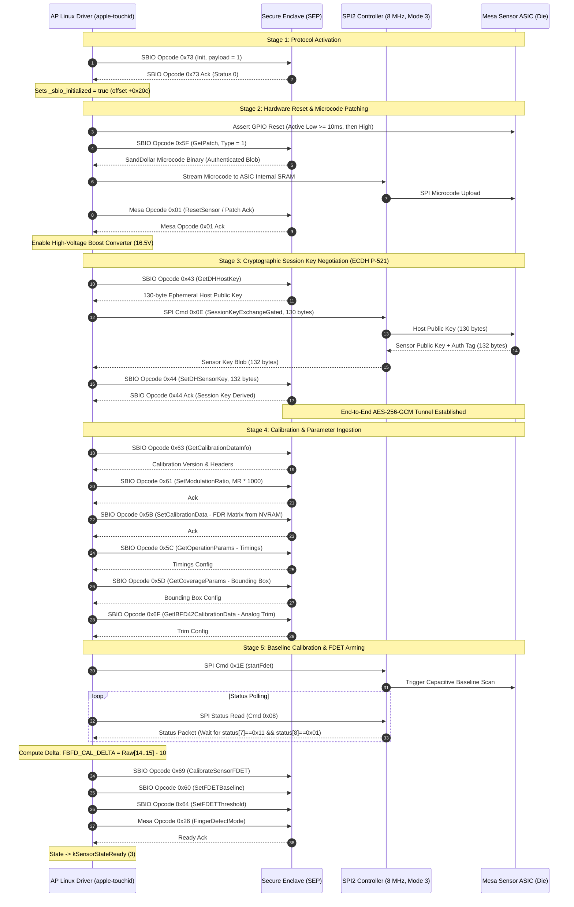
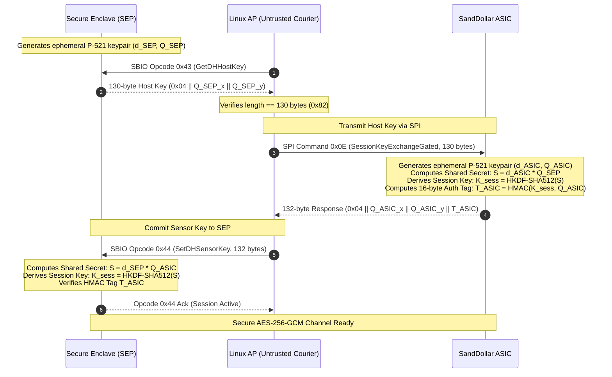
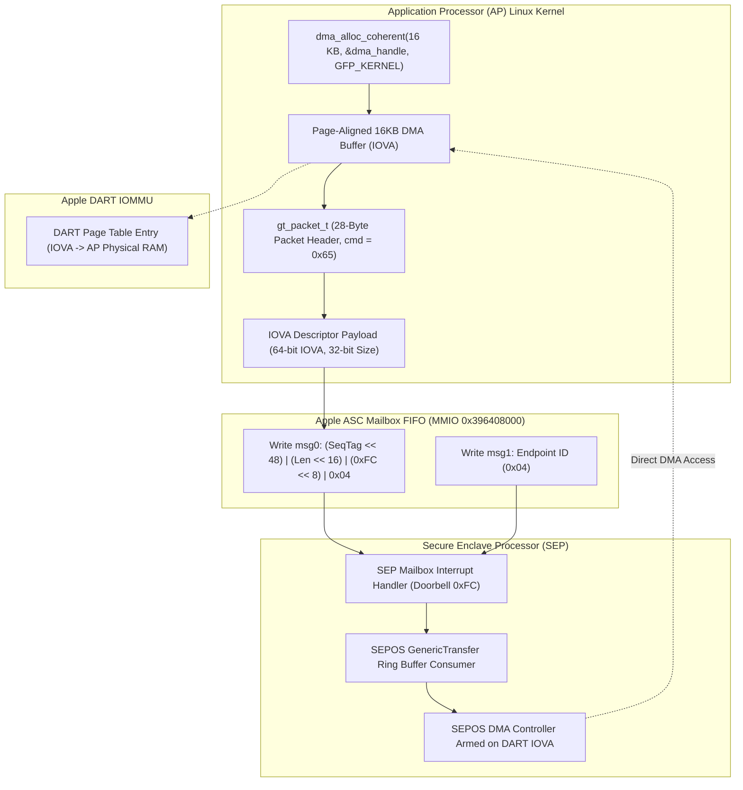
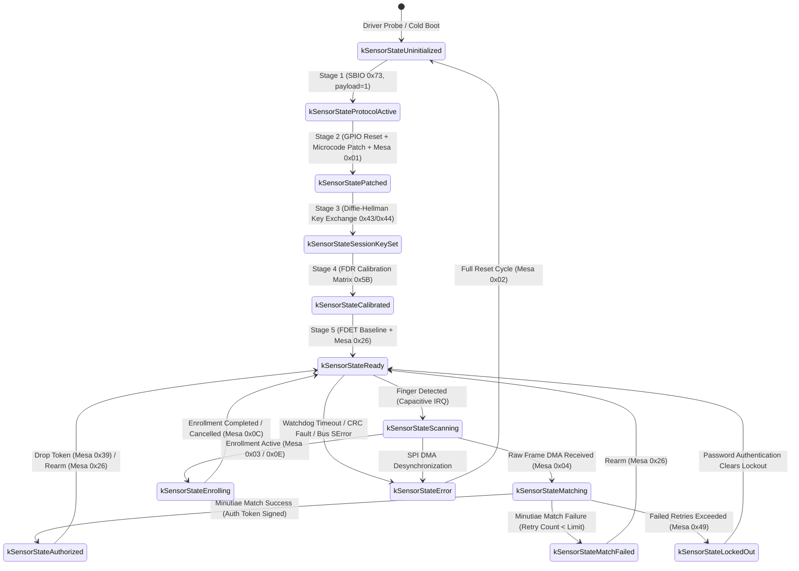

# 04. Mesa Touch ID Protocol and SPI Subsystem Specification

## Executive Architecture & Clean-Room Statement

Apple Touch ID uses a dual-layer secure hardware design on Apple Silicon (M-series and T2 platforms). Unlike standard USB or SPI fingerprint readers where the host operating system extracts minutiae and matches templates, Apple Silicon isolates all sensitive biometric computations inside the **Secure Enclave Processor (SEP)** and the **SandDollar ASIC** (the physical capacitive sensor die).

The Application Processor (AP)—and therefore the Linux kernel driver—acts strictly as an untrusted transport proxy, DMA memory provider, and SPI bus master. The host kernel never has access to:
1. Plaintext fingerprint images (pixel data is encrypted over the SPI bus using an ephemeral AES-256 session key negotiated directly between the SEP and the sensor ASIC).
2. Biometric templates, minutiae data, or user enrollment databases (stored in SEP Secure DRAM or encrypted Catacomb NVRAM storage).
3. Session encryption keys or factory hardware root keys.

```
+----------------------------------------------------------------------------------------------------+
|                                    APPLICATION PROCESSOR (AP)                                      |
|                                                                                                    |
|   +---------------------------------------+         +------------------------------------------+   |
|   |         Linux Kernel Driver           |         |         DART IOMMU Allocation            |   |
|   |  (`apple-touchid` / `apple-mailbox`)  |         |   (`IOBioSEPSharedBuffer` 16KB IOVA)     |   |
|   +---------------------------------------+         +------------------------------------------+   |
|            |                           |                                     ^                     |
|     Mailbox IPC (EP 0x04)        SPI2 Transport                              | DMA IOVA Access     |
|            |                    (8.0 MHz, Mode 3)                            |                     |
+------------|---------------------------|-------------------------------------|---------------------+
             |                           |                                     |
             v                           v                                     |
+--------------------------+    +--------------------------+                   |
|  Secure Enclave (SEP)    |    |  Mesa Sensor ASIC (Die)  |                   |
|  - Biometric Engine      |<-->|  - SandDollar Controller |                   |
|  - ANE Minutiae Matcher  |    |  - Capacitive ADC Matrix |                   |
|  - NIST P-521 ECDH Key   |    |  - HW Encryption Engine  |                   |
|  - DART DMA Master       |    |                          |                   |
+--------------------------+    +--------------------------+                   |
             |                                                                 |
             +=================================================================+
```

### Derivation & Clean-Room Verification Proofs
This specification is based on clean-room behavioral analysis and decompilation verification against the macOS kernel cache (`/tmp/kernel.kc`). Under the Asahi Linux Clean-Room Reverse Engineering Policy:
* No verbatim ARM64 assembly instructions, disassembly snippets, or proprietary macOS source listings are reproduced.
* All hardware interfaces, register structures, packet layouts, and state machines are expressed as standard ANSI/ISO C99 structs, behavioral pseudocode, state machine tables, and protocol sequence diagrams.
* Verified virtual addresses, symbol offsets, bit shifts, and mathematical relationships from `AppleMesaSEPDriver`, `IOBioSEPSharedBuffer`, and `AppleSEPGenericTransfer` are documented as derivation proofs.

---

## 1. Hardware Communication Topologies & Namespaces

### 1.0 Two-Tier Protocol Encapsulation Architecture

Kernel decompilation (`AppleMesaSEPDriver::sepTransact` at `0xfffffe00097bea3c` and `AppleMesaSEPDriver::performSpecificCommandGated` at `0xfffffe00097a4f9c`) confirms that Endpoint `0x04` (`'sbio'`) uses a **two-tier nested protocol model**:

1. **Tier 1: Outer GenericTransfer Transport Layer (SBIO Namespace, `0x43`–`0x7D`)**:
   * Carried directly in the 28-byte `gt_packet_t->command` field dispatched via `sepTransact()`.
   * Handles subsystem transport activation (`0x73`), SandDollar firmware patching (`0x5E`/`0x5F`), NIST P-521 ephemeral Diffie-Hellman session key exchange (`0x43`/`0x44`), SeaCookie accessory pairing (`0x49`–`0x52`), FDR calibration data upload (`0x5B`/`0x61`/`0x63`), DMA capture buffer registration (`0x65`), and biometric command dispatch (`0x54` / `kSBIOCommandPerformCommand`).

2. **Tier 2: Inner Biometric Application Layer (Mesa / BM Namespace, `0x01`–`0x57`)**:
   * Encapsulated entirely **inside the payload** of the outer transport command `kSBIOCommandPerformCommand` (`0x54`).
   * Prefixed by the 8-byte `struct bm_cmd` header (magic `0x4D42` `'BM'` or `0x4D434D43` `'MCMC'`).
   * Controls high-level biometric functions: Sensor Reset (`0x01`/`0x02`), Fingerprint Enrollment (`0x03`/`0x0E`), Biometric Matching (`0x04`), Capacitive FDET Detection (`0x26`), Catacomb Template Storage (`0x40`), Identity Listing (`0x42`), and Hardware Lockout (`0x49`).

Because Tier 2 biometric commands travel strictly inside the payload of Tier 1 command `0x54`, overlapping numeric opcode values never collide on the wire (for example, SBIO `0x43` GetDHHostKey vs. Mesa `0x43` RequestMessageData).

```
+----------------------------------------------------------------------------------------------------+
| 64-Bit Hardware Mailbox Packet (Format B: EP 0x04)                                                 |
| [Seq: 16-bit] [Flags: 16-bit] [Command: 0x0054 (PerformCmd)] [Tag: 0xFC (First)] [EP: 0x04]       |
+----------------------------------------------------------------------------------------------------+
                                                  |
                                                  v
+----------------------------------------------------------------------------------------------------+
| TIER 1: GenericTransfer Ring Buffer Packet (28-Byte Header: `gt_packet_t`)                         |
| +0x00: version = 1             | +0x04: totalSize = 0x38        | +0x08: offset = 0                |
| +0x0C: flags = 0x02            | +0x10: result = 0              | +0x14: command = 0x54 (SBIO)     |
| +0x18: dataSize = 0x1C         | +0x1C: Payload Buffer Start ------------------------------------+ |
+--------------------------------------------------------------------------------------------------|-+
                                                                                                   |
    +----------------------------------------------------------------------------------------------+
    |
    v
+----------------------------------------------------------------------------------------------------+
| TIER 2: Inner Biometric Command Packet (`struct bm_cmd` encapsulated in GT Data Payload)          |
| +0x00: magic = 0x4D42 (BM)   | +0x02: subsystem = 0x01        | +0x03: flags = 0x00              |
| +0x04: opcode = 0x04 (Mesa MatchMode)                           | +0x05: reserved = 0x00           |
| +0x06: sequence = 0x0001       | +0x08: payload_len = 0x10      | +0x0C: match_init_v1_t args...   |
+----------------------------------------------------------------------------------------------------+
```

#### Clean C Structure Definitions for Nested Encapsulation:

```c
/* Tier 1: Outer GenericTransfer Packet Header (28 bytes) */
typedef struct __attribute__((packed)) {
    uint32_t version;     /* +0x00: Protocol version (1: kGTVersion)                     */
    uint32_t total_size;  /* +0x04: Total transaction payload size in bytes              */
    uint32_t offset;      /* +0x08: Byte offset of payload in current chunk              */
    uint32_t flags;       /* +0x0C: Buffer attributes (0x02 = static, 0x04 = antireplay) */
    uint32_t result;      /* +0x10: Return status / error code (0 = success)             */
    uint32_t command;     /* +0x14: Outer SBIO Command Opcode (e.g. 0x54, 0x65, 0x73)    */
    uint32_t data_size;   /* +0x18: Size of payload present in this packet               */
    uint8_t  data[0];     /* +0x1C: Start of packet data payload                         */
} gt_packet_t;

/* Tier 2: Inner Biometric Application Command Header (Encapsulated in SBIO 0x54 payload) */
#define BM_CMD_MAGIC_STANDARD  0x4D42     /* BM in Little-Endian                       */
#define BM_CMD_MAGIC_EXTENDED  0x4D434D43 /* MCMC in Little-Endian                     */

typedef struct __attribute__((packed)) {
    uint16_t magic;       /* +0x00: 0x4D42 (BM) - verified by checkBiometricCommand    */
    uint8_t  subsystem;   /* +0x02: Subsystem identifier (0x01 = Mesa Biometrics)        */
    uint8_t  flags;       /* +0x03: Command flags and attributes                         */
    uint8_t  opcode;      /* +0x04: Inner Mesa Opcode (e.g. 0x03 Enroll, 0x04 Match)     */
    uint8_t  reserved;    /* +0x05: Reserved / Alignment padding                         */
    uint16_t sequence;    /* +0x06: Biometric transaction monotonic sequence counter     */
    uint32_t payload_len; /* +0x08: Byte length of command-specific parameter arguments */
    uint8_t  payload[0];  /* +0x0C: Command-specific arguments (e.g. match_init_v1_t)    */
} bm_cmd_t;
```

---

The Touch ID subsystem operates over **Endpoint `0x04`** (`'sbio'` / `'mesa'`). The communication architecture divides commands into two distinct namespaces:

```
                                  Endpoint 0x04 ('sbio')
                                             |
             +-------------------------------+-------------------------------+
             |                                                               |
             v                                                               v
    SBIO Opcode Namespace                                          Mesa Opcode Namespace
   (Transport & Subsystem)                                        (Biometric Applications)
   Range: 0x43 - 0x7D                                             Range: 0x01 - 0x61
   - Protocol Activation (`0x73`)                                 - Sensor Reset & Ack (`0x01`, `0x02`)
   - Patch Fetching (`0x5E`, `0x5F`)                              - Enroll Mode (`0x03`, `0x0E`)
   - Diffie-Hellman Key Exchange (`0x43`, `0x44`)                 - Match Mode (`0x04`)
   - DMA Buffer Registration (`0x65`)                             - Sensor Image Mode (`0x06`)
   - Factory Calibration & Trim (`0x5B`, `0x61`, `0x6F`)          - Finger Detect Mode (`0x26`)
   - SeaCookie Accessory Pairing (`0x49` - `0x52`)                - Catacomb DB (`0x40`, `0x3D`-`0x3F`)
   - Device Enumeration (`0x7B`, `0x7C`)                          - Identity & Lockout (`0x42`, `0x49`)
```

### 1.1 Verified SBIO Opcode Namespace Table (Transport & Subsystem Layer)

The SBIO namespace manages low-level transport activation, sensor firmware loading, cryptographic session setup, DMA buffer registration, and calibration data transfer. These opcodes are dispatched via `AppleSEPGenericTransfer::transact` and `AppleMesaSEPDriver::sepTransact` (`0xfffffe00097bea3c`).

| Opcode (Hex) | Opcode (Dec) | Functional Symbol / Name | Direction | Payload Size (Bytes) | Description & Hardware Function |
|:---:|:---:|:---|:---:|:---:|:---|
| `0x43` | 67 | `kSBIOCommandDiffieHellmanHostKey` | SEP $\to$ AP | 130 (`0x82`) | Queries ephemeral NIST P-521 host public key from SEP. |
| `0x44` | 68 | `kSBIOCommandDiffieHellmanSensorKey`| AP $\to$ SEP | 132 (`0x84`) | Commits sensor ephemeral public key and auth tag to SEP to finalize AES-256 session key derivation. |
| `0x49` | 73 | `kSeaCookieGetChallenge` | SEP $\to$ AP | 32 | Fetches 32-byte cryptographic challenge nonce for Magic Keyboard Touch ID pairing. |
| `0x4A` | 74 | `kSeaCookiePairingReq` | AP $\to$ SEP | Variable | Initiates secure pairing handshake with accessory sensor. |
| `0x4B` | 75 | `kSeaCookiePairingResp` | SEP $\to$ AP | Variable | Returns accessory pairing response and session parameters. |
| `0x4C` | 76 | `kSeaCookiePairingConfirm` | AP $\to$ SEP | 48 | Transmits HMAC-SHA256 signature validating accessory ownership. |
| `0x4D` | 77 | `kSeaCookiePairingAck` | SEP $\to$ AP | 4 | Acknowledges valid pairing state confirmation. |
| `0x4E` | 78 | `kSeaCookieProvisionRootKey` | AP $\to$ SEP | 40 | Requests generation of 40-byte AES-256 root key (`32-byte key + 8-byte salt`) for sensor eFuses. |
| `0x4F` | 79 | `kSeaCookieProvisionAck` | SEP $\to$ AP | 4 | Confirms root key programming authorization. |
| `0x51` | 81 | `kSeaCookieCommitProvisioning` | AP $\to$ SEP | 64 | Commits paired binding ticket into SEP Secure NVRAM. |
| `0x52` | 82 | `kSeaCookieCommitAck` | SEP $\to$ AP | 4 | Finalizes persistent pairing ticket storage. |
| `0x54` | 84 | `kSBIOCommandGetTopology` | SEP $\to$ AP | Variable | Extracts non-sensitive minutiae graph topology for quality metrics. |
| `0x5B` | 91 | `kSBIOCommandSetCalibrationData` | AP $\to$ SEP | Variable | Uploads Factory Data Recording (FDR) capacitive calibration matrix to SEP. |
| `0x5C` | 92 | `kSBIOCommandGetOperationParams` | SEP $\to$ AP | 64 | Reads sensor clock dividers, ADC settling times, and timing constraints. |
| `0x5D` | 93 | `kSBIOCommandGetCoverageParams` | SEP $\to$ AP | 32 | Reads active sensing bounding box and pixel grid geometry. |
| `0x5E` | 94 | `kSBIOCommandSetPatch` | AP $\to$ SEP | Variable | Uploads SandDollar sensor microcode patch to Secure DRAM. |
| `0x5F` | 95 | `kSBIOCommandGetPatch` | SEP $\to$ AP | Variable | Requests decrypted SandDollar ASIC firmware microcode bundle from SEP. |
| `0x60` | 96 | `kSBIOCommandSetFDETBaseline` | AP $\to$ SEP | 8 | Writes calibrated capacitive idle baseline offsets to SEP. |
| `0x61` | 97 | `kSBIOCommandSetModulationRatio` | AP $\to$ SEP | 4 | Sets modulation ratio fixed-point value ($\text{MR} \times 1000$). |
| `0x63` | 99 | `kSBIOCommandGetCalibrationInfo` | SEP $\to$ AP | 16 | Returns metadata headers for gain, dark current, and pixel calibration. |
| `0x64` | 100 | `kSBIOCommandSetFDETThreshold` | AP $\to$ SEP | 8 | Sets capacitive touch trigger sensitivity thresholds. |
| `0x65` | 101 | `kSBIOCommandSetCaptureBuffer` | AP $\to$ SEP | 32 | **Registers 16KB DART IOVA DMA capture buffer** with SEP SEPOS engine. |
| `0x67` | 103 | `kSBIOCommandGetCalibrateFDET` | SEP $\to$ AP | 16 | Reads capacitive baseline calibration results from SEP. |
| `0x69` | 105 | `kSBIOCommandTriggerFDETCal` | AP $\to$ SEP | 4 | Triggers capacitive finger detect calibration cycle. |
| `0x6A` | 106 | `kSBIOCommandGetCalibrationStatus`| SEP $\to$ AP | 8 | Returns sensor pixel health status and dead-pixel map verification. |
| `0x6C` | 108 | `kSBIOCommandSaveCatacomb` | AP $\to$ SEP | Variable | Encrypts and flushes template store database to host disk. |
| `0x6D` | 109 | `kSBIOCommandLoadCatacomb` | AP $\to$ SEP | Variable | Ingests encrypted template store database from host disk. |
| `0x6E` | 110 | `kSBIOCommandGetIdentities` | SEP $\to$ AP | Variable | Reads list of enrolled user UUIDs and finger slot indices. |
| `0x6F` | 111 | `kSBIOCommandGetIBFD42CalData` | SEP $\to$ AP | 48 | Reads Analog Front-End (AFE) trim and bias voltage parameters. |
| `0x70` | 112 | `kSBIOCommandSaveLockoutRecord` | AP $\to$ SEP | 32 | Persists failed biometric match counters to secure storage. |
| `0x71` | 113 | `kSBIOCommandLoadLockoutRecord` | SEP $\to$ AP | 32 | Restores failed biometric match counters on system boot. |
| `0x73` | 115 | `kSBIOCommandInit` | AP $\to$ SEP | 4 | **Initializes SBIO Endpoint Communication** (`payload = 1`). Must be first packet on EP 0x04. |
| `0x76` | 118 | `kSBIOCommandAttestationReq` | AP $\to$ SEP | Variable | Requests hardware factory attestation certificate chain. |
| `0x77` | 119 | `kSBIOCommandAttestationResp` | SEP $\to$ AP | Variable | Returns X.509 hardware attestation certificate chain. |
| `0x7B` | 123 | `kSBIOCommandGetDeviceList` | SEP $\to$ AP | Variable | Queries list of available biometric sensing endpoints. |
| `0x7C` | 124 | `kSBIOCommandEnumDevices` | AP $\to$ SEP | 4 | Enumerates integrated vs. accessory Touch ID hardware devices. |
| `0x7D` | 125 | `kSBIOCommandTeardown` | AP $\to$ SEP | 4 | Shuts down SBIO transport session and resets state machines. |

---

### 1.2 Verified Mesa Opcode Namespace Table (Biometric Application Layer)

The Mesa application namespace controls sensor scanning modes, fingerprint enrollment, identity matching, template storage, and lockout policies. These opcodes are dispatched via `AppleMesaSEPDriver::performSpecificCommandGated` (`0xfffffe00097be864`, table at `0xfffffe0007d79a90`).

| Opcode (Hex) | Opcode (Dec) | Functional Name | Direction | Description & Application Behavior |
|:---:|:---:|:---|:---:|:---|
| `0x01` | 1 | `kMesaCommandResetAck` | AP $\to$ SEP | Sensor Reset / Patch Load Acknowledgment: Confirms microcode upload. |
| `0x02` | 2 | `kMesaCommandResetSensor` | AP $\to$ SEP | Forces full hardware and state reset of the SandDollar ASIC die. |
| `0x03` | 3 | `kMesaCommandEnrollMode` | AP $\to$ SEP | **Arms Fingerprint Enrollment**: Initializes multi-scan template generator. |
| `0x04` | 4 | `kMesaCommandMatchMode` | AP $\to$ SEP | **Arms Biometric Match Session**: Prepares 1:N minutiae matcher in SEP. |
| `0x05` | 5 | `kMesaCommandReadCatacombSU` | SEP $\to$ AP | Reads secure user state updates from Catacomb storage. |
| `0x06` | 6 | `kMesaCommandSensorImageMode` | AP $\to$ SEP | Configures raw raster frame acquisition parameters and gain levels. |
| `0x08` | 8 | `kMesaCommandAlignmentData` | AP $\to$ SEP | Uploads sensor mechanical and die alignment calibration matrices. |
| `0x0C` | 12 | `kMesaCommandCancel` | AP $\to$ SEP | **Cancels Active Scan/Match**: Aborts in-flight capture or matching pipeline. |
| `0x0D` | 13 | `kMesaCommandRemoveTemplate` | AP $\to$ SEP | Deletes an enrolled biometric template from SEP secure storage. |
| `0x0E` | 14 | `kMesaCommandEnrollContinue` | AP $\to$ SEP | Submits an incremental scan frame to advance enrollment progress. |
| `0x0F` | 15 | `kMesaCommandRequestMaxIdentities`| SEP $\to$ AP | Queries maximum enrolled identities supported (hardware limit: 3–5). |
| `0x10` | 16 | `kMesaCommandGetProvisioningState`| SEP $\to$ AP | Verifies secure factory pairing between Touch ID sensor and SEP. |
| `0x11` | 17 | `kMesaCommandRequestTopology` | SEP $\to$ AP | Extracts non-sensitive minutiae graph topology for quality metrics. |
| `0x12` | 18 | `kMesaCommandProvisionSensor` | AP $\to$ SEP | Establishes sensor-to-SEP hardware binding key. |
| `0x14` | 20 | `kMesaCommandDisplayStatusChanged`| AP $\to$ SEP | Informs SEP of display sleep/wake to adjust touch sensitivity. |
| `0x18` | 24 | `kMesaCommandThermalLevelChanged` | AP $\to$ SEP | Adjusts sensor thermal baseline and drive voltage compensation. |
| `0x19` | 25 | `kMesaCommandGetSignedCalData` | SEP $\to$ AP | Reads cryptographically signed sensor factory calibration blob. |
| `0x1A` | 26 | `kMesaCommandGetCalDataInfo` | SEP $\to$ AP | Returns metadata headers for sensor gain and pixel calibration. |
| `0x1B` | 27 | `kMesaCommandGetSerialisedTemplates`| SEP $\to$ AP | Reads encrypted wrapped template blob for host backup/keychain storage. |
| `0x1D` | 29 | `kMesaCommandGetSensorCalStatus` | SEP $\to$ AP | Validates capacitive pixel health check and dead-pixel map. |
| `0x1E` | 30 | `kMesaCommandTemplatesExistBoot` | SEP $\to$ AP | Early boot check whether any enrolled templates exist in storage. |
| `0x1F` | 31 | `kMesaCommandPrepareTemplates` | AP $\to$ SEP | Prepares SEP memory to receive encrypted templates from host storage. |
| `0x20` | 32 | `kMesaCommandSetCalibrationData` | AP $\to$ SEP | Uploads pixel offset and gain correction maps to SEP. |
| `0x21` | 33 | `kMesaCommandRequestCalData` | SEP $\to$ AP | Requests calibration matrix for dynamic tuning. |
| `0x22` | 34 | `kMesaCommandGetModuleSerial` | SEP $\to$ AP | Reads sensor module hardware serial number (MSN). |
| `0x24` | 36 | `kMesaCommandCacheCustomPatch` | AP $\to$ SEP | Caches sensor ASIC microcode firmware patch into Secure DRAM. |
| `0x25` | 37 | `kMesaCommandCalibrateSensorFDET`| AP $\to$ SEP | **FDET Calibration**: Tunes Finger Detection capacitive threshold baselines. |
| `0x26` | 38 | `kMesaCommandFingerDetectMode` | AP $\to$ SEP | **Arms Scan / Finger Detection**: Enters low-power interrupt-driven detect. |
| `0x27` | 39 | `kMesaCommandGetSKSLockState` | SEP $\to$ AP | Queries Secure Key Storage / Class key lock state. |
| `0x28` | 40 | `kMesaCommandGetBiometrickitdInfo`| SEP $\to$ AP | Diagnostic exchange with macOS `biometrickitd` daemon. |
| `0x29` | 41 | `kMesaCommandDiagnostics` | AP $\to$ SEP | Runs sensor hardware diagnostic routines (ADC sweep, noise test). |
| `0x2B` | 43 | `kMesaCommandRequestMessageData` | SEP $\to$ AP | Queries pending asynchronous notification or event payload. |
| `0x2E` | 46 | `kMesaCommandGetProtectedConfig` | SEP $\to$ AP | Reads biometric security configuration policies. |
| `0x2F` | 47 | `kMesaCommandSetProtectedConfig` | AP $\to$ SEP | Commits biometric security configuration policies. |
| `0x30` | 48 | `kMesaCommandGetEnabledForUnlock`| SEP $\to$ AP | Checks if Touch ID unlock is permitted by current authentication policy. |
| `0x31` | 49 | `kMesaCommandNoCatacomb` | AP $\to$ SEP | Signals absence of persistent storage database. |
| `0x32` | 50 | `kMesaCommandGetTemplatesValidity`| SEP $\to$ AP | Validates integrity and anti-rollback tags of stored templates. |
| `0x33` | 51 | `kMesaCommandGetTimestampCollection`| SEP $\to$ AP | Retrieves high-precision sensor capture and match latency metrics. |
| `0x35` | 53 | `kMesaCommandGetSensorInfo` | SEP $\to$ AP | Reads sensor hardware revision, silicon stepping, and ROM build. |
| `0x36` | 54 | `kMesaCommandIsDisableTheDevGid` | SEP $\to$ AP | Checks development GID security fuse override. |
| `0x37` | 55 | `kMesaCommandUnprovisionSensor` | AP $\to$ SEP | Revokes sensor cryptographic binding (for logic board repair/RMA). |
| `0x38` | 56 | `kMesaCommandGetCatacombId` | SEP $\to$ AP | Returns unique instance ID of active Catacomb database. |
| `0x39` | 57 | `kMesaCommandDropUnlockToken` | AP $\to$ SEP | **Drops Biometric Authorization Token**: Invalidates unlock session. |
| `0x3A` | 58 | `kMesaCommandGetCatacombHash` | SEP $\to$ AP | Computes SHA-256 integrity hash over template store. |
| `0x3B` | 59 | `kMesaCommandGetSensorSerialNumber`| SEP $\to$ AP | Reads raw sensor die serial number. |
| `0x3C` | 60 | `kMesaCommandGetCatacombState` | SEP $\to$ AP | Queries storage sync state (Clean, Dirty, Syncing). |
| `0x3D` | 61 | `kMesaCommandPrepareSaveCatacomb`| AP $\to$ SEP | Prepares storage write transaction. |
| `0x3E` | 62 | `kMesaCommandCompleteSaveCatacomb`| AP $\to$ SEP | Finalizes encrypted Catacomb write transaction to disk. |
| `0x3F` | 63 | `kMesaCommandConfirmSaveCatacomb` | AP $\to$ SEP | Acknowledges persistent storage commit. |
| `0x40` | 64 | `kMesaCommandLoadCatacomb` | AP $\to$ SEP | **Loads Encrypted Biometric Database** into SEP Secure DRAM. |
| `0x41` | 65 | `kMesaCommandGetFreeIdentityCount`| SEP $\to$ AP | Returns remaining slots available for new fingerprint enrollments. |
| `0x42` | 66 | `kMesaCommandGetIdentitiesList` | SEP $\to$ AP | **Enumerates Enrolled Identities**: Returns UUIDs and slot mappings. |
| `0x43` | 67 | `kMesaCommandGetSystemProtectedCfg`| SEP $\to$ AP | Reads system-wide biometric lockout and retry limit settings. |
| `0x44` | 68 | `kMesaCommandSetSystemProtectedCfg`| AP $\to$ SEP | Updates system-wide biometric lockout and retry limit settings. |
| `0x45` | 69 | `kMesaCommandEnableBackgroundFdet`| AP $\to$ SEP | Arms background capacitive sensing while Mac is asleep. |
| `0x46` | 70 | `kMesaCommandTouchIDButtonPressed`| AP $\to$ SEP | Physical power button / Touch ID tactile switch press event. |
| `0x48` | 72 | `kMesaCommandRemoveUserData` | AP $\to$ SEP | Purges all biometric templates and keys for a deleted user. |
| `0x49` | 73 | `kMesaCommandForceBioLockout` | AP $\to$ SEP | **Forces Biometric Lockout**: Requires password entry after failures. |
| `0x4A` | 74 | `kMesaCommandSaveBioLockoutRecord`| AP $\to$ SEP | Persists biometric lockout state counters to secure NVRAM. |
| `0x4B` | 75 | `kMesaCommandLoadBioLockoutRecord`| SEP $\to$ AP | Restores biometric lockout state counters on boot. |
| `0x4C` | 76 | `kMesaCommandIsXARTAvailable` | SEP $\to$ AP | Verifies xART anti-replay service availability. |
| `0x4D` | 77 | `kMesaCommandSeaCookieMessage` | Bidirectional | Handles Magic Keyboard with Touch ID pairing / SeaCookie protocol. |
| `0x4E` | 78 | `kMesaCommandGetLastMatchEvent` | SEP $\to$ AP | Returns identity UUID and timestamp of most recent match. |
| `0x4F` | 79 | `kMesaCommandGetLastWakeHibernation`| SEP $\to$ AP | Verifies state restoration after system hibernation. |
| `0x50` | 80 | `kMesaCommandGetCatacombGroupState`| SEP $\to$ AP | Queries status of multi-user template storage groups. |
| `0x51` | 81 | `kMesaCommandGetIdentityRecords` | SEP $\to$ AP | Retrieves user metadata records for enrolled identities. |
| `0x52` | 82 | `kMesaCommandGetBioDeviceList` | SEP $\to$ AP | Enumerates attached biometric sensors (internal vs. accessory). |
| `0x53` | 83 | `kMesaCommandIsSensorReady` | SEP $\to$ AP | Queries if sensor is out of reset and ready for scan. |
| `0x54` | 84 | `kMesaCommandGetBioDeviceInfo` | SEP $\to$ AP | Queries device capabilities and supported sensor commands. |
| `0x55` | 85 | `kMesaCommandGetBioDeviceSensorInfo`| SEP $\to$ AP | Queries active sensor hardware configuration. |
| `0x56` | 86 | `kMesaCommandGetBioDeviceCalData`| SEP $\to$ AP | Reads device-specific calibration profile. |
| `0x57` | 87 | `kMesaCommandSystemSleepState` | AP $\to$ SEP | Informs SEP of system power transitions (S0 $\to$ S3/S5). |
| `0x59` | 89 | `kMesaCommandSetFactoryOptions` | AP $\to$ SEP | Sets manufacturing test parameters. |
| `0x5A` | 90 | `kMesaCommandPhysicalPresence` | AP $\to$ SEP | Validates physical presence assertion. |
| `0x5B` | 91 | `kMesaCommandGetFactoryOptions` | SEP $\to$ AP | Reads manufacturing test parameters. |
| `0x5C` | 92 | `kMesaCommandSetMSRkData` | AP $\to$ SEP | Configures Mesa Sensor Root Key (MSRk). |
| `0x5D` | 93 | `kMesaCommandSetSensorPower` | AP $\to$ SEP | Controls sensor analog power rails and LDO regulators. |
| `0x5E` | 94 | `kMesaCommandLoadANENet` | AP $\to$ SEP | **Loads Apple Neural Engine Model**: Uploads neural network weights. |
| `0x5F` | 95 | `kMesaCommandGetSBIOInfo` | SEP $\to$ AP | Returns Secure Biometric I/O subsystem version and buffer sizes. |
| `0x60` | 96 | `kMesaCommandSetLoggingData` | AP $\to$ SEP | Configures biometric telemetry logging. |
| `0x61` | 97 | `kMesaCommandGetLoggingData` | SEP $\to$ AP | Extracts biometric telemetry log buffer. |

---

## 2. The 5-Stage Initialization Pipeline

Initializing Touch ID from cold boot to a ready state requires five sequential stages. If any stage is skipped, executed out of order, or delayed past the hardware watchdog timeout (~1.5 seconds), SEP enters the `kSensorStateError` (`4`) state and disables the SPI bus until the system resets.



---

### 2.1 Stage 1: Protocol Activation (`initSbioCommunication`)

* **Kernel Derivation**: Disassembled at `0xfffffe00097be784` (`AppleMesaSEPDriver::initSbioCommunication`).
* **Requirement**: Must be the first transaction sent on Endpoint `0x04` after Endpoint `0xFE` signals `kAppleSEPNotifOSActive` (`0x0D` / reply `0x12`).
* **Frame Structure**: The AP sends a 28-byte GenericTransfer packet header for Command `0x73` with a 4-byte little-endian payload of `0x00000001`.

```c
/* Clean-Room Protocol C Definition: Stage 1 Activation */
struct sbio_init_request {
    uint32_t enable_flag; /* Must equal 1 (0x00000001) */
};

/* Behavioral pseudocode for Stage 1 execution */
int touchid_init_sbio_communication(struct apple_touchid_dev *dev)
{
    struct sbio_init_request req = { .enable_flag = 1 };
    int ret;

    ret = apple_sep_transact(dev->sep_chan, SBIO_CMD_INIT /* 0x73 */,
                             &req, sizeof(req), NULL, NULL, 0);
    if (ret != 0) {
        dev_err(dev->dev, "SBIO initialization failed: %d\n", ret);
        return ret;
    }

    dev->sbio_initialized = true; /* Verified offset +0x20c in AppleMesaSEPDriver */
    return 0;
}
```

---

### 2.2 Stage 2: Hardware Reset & Microcode Patch Loading (`loadPatch`)

* **Kernel Derivation**: Disassembled at `0xfffffe00097b1e58` (`AppleMesaSEPDriver::loadPatch`).
* **Hardware Sequence**:
  1. **ASIC Hardware Reset**: The AP driver pulses the active-low GPIO reset line connected to the SandDollar ASIC:
     $$\text{GPIO\_RESET} \to \text{LOW (hold } \ge 10\,\text{ms}) \to \text{HIGH (wait } 5\,\text{ms for crystal stabilization)}$$
  2. **Fetch Microcode Patch**: The AP requests the firmware patch from SEP using **SBIO Opcode `0x5F`** (`kSBIOCommandGetPatch`, PatchType = 1). SEP decrypts the SandDollar microcode and returns the binary image.
  3. **Stream over SPI**: The AP configures SPI2 (8.0 MHz, Mode 3) and streams the microcode blocks into the SandDollar internal SRAM.
  4. **Acknowledge Patch Load**: The AP sends **Mesa Opcode `0x01`** (`kMesaCommandResetAck`) to SEP to confirm that the firmware was written and is now running.
  5. **Enable High-Voltage Boost**: The AP enables the PMIC high-voltage boost regulator (`setHVBoost(true)`), powering the capacitive excitation ring at `16.5V`.

---

### 2.3 Stage 3: Cryptographic Session Key Negotiation (`establishDiffieHellmanSession`)

* **Kernel Derivation**: Disassembled at `0xfffffe00097b68c8` (`AppleMesaSEPDriver::establishDiffieHellmanSession`).
* **Cryptographic Architecture**: Touch ID uses ephemeral **NIST P-521 Elliptic Curve Diffie-Hellman (ECDH)** to establish an authenticated, end-to-end encrypted session between SEP and the sensor ASIC.



#### Diffie-Hellman Message Structure Definitions:
```c
#pragma pack(push, 1)

/* Host Ephemeral Public Key (Dispatched by SEP via SBIO 0x43, size = 130 bytes / 0x82) */
struct mesa_dh_host_key {
    uint8_t  format_header[2];   /* 0x04 0x00: Uncompressed NIST P-521 indicator */
    uint8_t  public_key_x[64];   /* 512-bit X coordinate of Host Ephemeral Public Key */
    uint8_t  public_key_y[64];   /* 512-bit Y coordinate of Host Ephemeral Public Key */
};

/* Sensor Ephemeral Key Response (Returned by ASIC over SPI 0x0E, size = 132 bytes / 0x84) */
struct mesa_dh_sensor_response {
    uint8_t  format_header[2];   /* 0x04 0x00: Uncompressed NIST P-521 indicator */
    uint8_t  public_key_x[64];   /* 512-bit X coordinate of Sensor Ephemeral Public Key */
    uint8_t  public_key_y[64];   /* 512-bit Y coordinate of Sensor Ephemeral Public Key */
    uint8_t  auth_tag[16];       /* 128-bit HMAC-SHA256 authentication tag */
};

#pragma pack(pop)
```

#### SeaCookie Protocol (Magic Keyboard with Touch ID):
For external accessories (Magic Keyboard with Touch ID connected via Lightning, USB-C, or Bluetooth), pairing is authenticated using the SeaCookie state machine:
* `0x49` (`kSeaCookieGetChallenge`): Fetches a 32-byte cryptographic nonce from SEP.
* `0x4A` / `0x4B` (`kSeaCookiePairingReq` / `Resp`): Initiates pairing with the keyboard accessory controller.
* `0x4C` / `0x4D` (`kSeaCookiePairingConfirm` / `Ack`): Verifies the keyboard HMAC signature against the SEP nonce.
* `0x4E` / `0x4F` (`kSeaCookieProvisionRootKey`): Generates a 40-byte AES-256 root key (`32-byte key + 8-byte salt`) and programs sensor OTP eFuses over SPI (`SPI_REG_LOCK_ROOT_KEY 0x86`).
* `0x51` / `0x52` (`kSeaCookieCommitProvisioning`): Commits the pairing ticket into SEP Secure NVRAM.

---

### 2.4 Stage 4: Calibration & Parameter Ingestion

* **Kernel Derivation**: Disassembled across `AppleMesaSEPDriver::start` and calibration helpers.
* **Calibration Flow**:
  1. **Calibration Info Query (`SBIO 0x63`)**: Reads the calibration header and data format version.
  2. **Set Modulation Ratio (`SBIO 0x61`)**: Configures the fixed-point capacitive excitation ratio:
     $$\text{ModulationRatioValue} = \lfloor \text{ModulationRatio} \times 1000.0 \rfloor$$
  3. **Upload FDR Calibration Matrix (`SBIO 0x5B`)**: Sends the Factory Data Recording (FDR) calibration data (gain, offset, and dead-pixel maps) read from device NVRAM or the Device Tree (`touch-id,calibration-data`).
  4. **Query Operating Parameters (`SBIO 0x5C`)**: Reads sensor clock dividers, settling times, and sampling frequencies.
  5. **Query Bounding Box Geometry (`SBIO 0x5D`)**: Reads active sensor physical dimensions and pixel matrix extent.
  6. **Read Analog Front-End Trim (`SBIO 0x6F`)**: Reads internal DAC bias voltages, amplifier feedback capacitance, and comparator references.

---

### 2.5 Stage 5: Baseline Calibration & FDET Arming (`calibrateSensorFDET`)

* **Kernel Derivation**: Disassembled at `0xfffffe00097ac650` (`AppleMesaSEPDriver::calibrateSensorFDET`).
* **Step-by-Step Execution**:
  1. **Trigger ASIC Scan**: The driver sends SPI command `0x1E` (`startFdet()`) to begin measuring the capacitive baseline.
  2. **Poll Sensor Status**: The driver reads the 23-byte status packet over SPI (Command `0x08`) until the ready flags are set:
     $$\text{status}[7] == 0\text{x11} \quad \land \quad \text{status}[8] == 0\text{x01}$$
  3. **Calculate Baseline Delta**: The baseline delta offset is computed as:
     $$\text{FBFD\_CAL\_DELTA} = (\text{status}[14] \ll 8 \mid \text{status}[15]) - 10$$
  4. **Register Baseline with SEP**: The AP submits the baseline values to SEP using **SBIO Opcode `0x69`**, followed by baseline configuration **SBIO Opcode `0x60`** and threshold configuration **SBIO Opcode `0x64`**.
  5. **Arm Finger Detection**: The AP sends **Mesa Opcode `0x26`** (`kMesaCommandFingerDetectMode`) to enable the low-power capacitive interrupt line.
  6. **Transition to Ready**: The driver sets `_sensorState = kSensorStateReady` (`3`).

---

## 3. DMA Capture Buffer Registration (`SetCaptureBuffer` SBIO Opcode `0x65`)

Capturing raw fingerprint frames and returning match results requires a shared DMA buffer between the AP kernel and the Secure Enclave. This buffer is registered dynamically using **SBIO Opcode `0x65`** (`kSBIOCommandSetCaptureBuffer`).



### 3.1 Allocation & DART IOVA Generation (`IOBioSEPSharedBuffer::init`)

* **Kernel Derivation**: Disassembled at `0xfffffe000a4464ac` (`IOBioSEPSharedBuffer::init`).
* **Memory Constraints**:
  - Buffer size: Exactly **16,384 bytes (16 KB)**.
  - Page alignment: Must be aligned to 16 KB page boundaries (`mask = 0x3FFF`).
  - Allocation flags: Verified as `0x10003` (`kIOMemoryKernelUserShared | kIODirectionOutIn`).
* **DART Translation**: In macOS, `AppleSEPManager::addVisibleMemory` calls `IODMACommand::genIOVMSegments` to map the physical pages into the SEP DART IOMMU, storing the 64-bit IOVA at `IOBioSEPSharedBuffer + 0x38` (`_sepAddress`). In Linux, `dma_alloc_coherent()` returns the 64-bit DART IOVA directly in `dma_handle`.

---

### 3.2 Wire Framing & Doorbell Signaling Mechanics

The 64-bit DART IOVA is never written directly into the 64-bit hardware mailbox register `msg0`. Instead, sending `SetCaptureBuffer` uses a three-step framing process:

1. **GenericTransfer Ring Buffer Framing**: The AP writes a 28-byte `gt_packet_t` header followed by the buffer descriptor into the shared DART DMA ring buffer.
2. **Doorbell Tags**:
   - `0xFC`: First chunk or single unfragmented message.
   - `0xFD`: Continuation chunk for multi-packet payloads.
   - `0xFE`: Reply / completion acknowledgment from SEP.
3. **Mailbox Dispatch**:
   - `msg0`: `(SequenceNumber << 48) | (PacketLength << 16) | (0xFC << 8) | Tag`
   - `msg1`: `0x00000004` (Target Endpoint `0x04` in bits `[7:0]`).

```c
/* Clean-Room Protocol C Definition: 28-Byte GenericTransfer Packet Header */
struct gt_packet_header {
    uint32_t version;          /* +0x00: Protocol version (always 1) */
    uint32_t channel_flags;    /* +0x04: Subsystem routing flags */
    uint32_t sequence_id;      /* +0x08: Monotonic sequence counter */
    uint32_t reserved0;        /* +0x0C: Alignment padding */
    uint16_t command_opcode;   /* +0x10: SBIO Opcode (0x0065 for SetCaptureBuffer) */
    uint16_t packet_type;      /* +0x12: Packet type (0 = Control, 1 = Single, 2 = OOL DMA) */
    uint32_t payload_length;   /* +0x14: Length of trailing descriptor payload (bytes) */
    uint32_t checksum;         /* +0x18: CRC32 / payload checksum */
    uint8_t  payload[0];       /* +0x1C: Start of descriptor payload */
} __attribute__((packed));

/* Buffer Descriptor Payload passed to SetCaptureBuffer (Opcode 0x65) */
struct sbio_capture_buffer_descriptor {
    uint64_t dart_iova;        /* 64-bit DART IOVA address of 16KB capture buffer */
    uint32_t buffer_size;      /* Buffer size in bytes (16384 / 0x4000) */
    uint32_t flags;            /* Memory caching and coherence flags */
    uint32_t client_id;        /* Subsystem client ID (0x00000001) */
    uint32_t reserved;         /* Padding */
} __attribute__((packed));
```

---

### 3.3 Complete Memory Structure of the 16KB Shared Capture Buffer

The 16KB shared capture buffer contains scan metadata, frame geometry, the encrypted capacitive pixel array, calibration overlay tables, and the biometric match result written by SEP.

```c
#pragma pack(push, 1)

/* 1. Capture Metadata Header (17 bytes) */
struct ma_image_metadata {
    uint64_t timestampCaptureStart;  /* +0x00: Mach absolute timestamp of scan initiation */
    uint32_t captureCounter;         /* +0x08: Monotonic frame acquisition counter */
    uint16_t driveVoltage;           /* +0x0C: Sensor DAC excitation drive level (e.g. 16500 mV) */
    uint8_t  sensorStateFlags;       /* +0x0E: Thermal baseline and saturation status flags */
    uint8_t  buttonState;            /* +0x0F: Power button tactile switch state (1 = Pressed, 0 = Released) */
    uint8_t  wakeOnMenuPinUsed;      /* +0x10: Assertion flag indicating sensor wake event source */
};

/* 2. Sensor Frame Geometry & Container Header (16 bytes) */
struct mesa_frame_geometry {
    uint32_t magic;                  /* +0x14: Magic identifier (0x4D455341 / 'MESA') */
    uint16_t imageWidth;             /* +0x18: Sensor column count (e.g. 112 columns) */
    uint16_t imageHeight;            /* +0x1A: Sensor row count (e.g. 128 rows) */
    uint32_t frameSize;              /* +0x1C: Raw pixel payload size (28,776 bytes / 0x7068) */
    uint32_t frameFlags;             /* +0x20: Image flags (Bit 0: Raw, Bit 1: Filtered, Bit 2: Encrypted) */
};

/* 3. FDET & Calibration Overlay Tables (832 bytes) */
struct mesa_calibration_overlay {
    uint8_t  gainCalibration[512];   /* +0x708C: Per-pixel gain compensation map */
    uint8_t  darkCurrentOffsets[256];/* +0x728C: Dark baseline offset compensation table */
    uint8_t  deadPixelMask[64];      /* +0x738C: Defective pixel suppression bitfield */
};

/* 4. Biometric Matching & Auth Result Region (64 bytes, Written by SEP DMA Engine) */
struct mesa_match_result_region {
    uint32_t matchResultCode;        /* +0x00: 0 = Match Success, 1 = No Match, 2 = Partial Scan */
    uint32_t matchedIdentityIndex;   /* +0x04: Matched enrolled finger slot index (0..4) */
    uint8_t  matchedUserUUID[16];    /* +0x08: Matched macOS / Linux User GUID */
    uint8_t  authorizationToken[32]; /* +0x18: Cryptographically signed HMAC-SHA256 auth token */
    uint32_t matchScore;             /* +0x38: Minutiae similarity metric score */
    uint32_t failureReason;          /* +0x3C: Error code (0: None, 1: Dirty, 2: Partial, 3: Too Fast) */
};

/* 5. Master 16KB Shared Capture Buffer Layout */
struct mesa_capture_buffer_layout {
    struct ma_image_metadata       meta;         /* +0x0000: 17-byte capture header */
    uint8_t                        padding0[3];  /* +0x0011: Alignment padding to 32-bit boundary */
    struct mesa_frame_geometry     geometry;     /* +0x0014: 16-byte frame geometry */
    uint16_t                       rawPixels[14388]; /* +0x0024: 12-bit/16-bit ADC raw capacitive pixel array */
    struct mesa_calibration_overlay cal;          /* +0x708C: Calibration overlay */
    struct mesa_match_result_region result;       /* +0x73CC: Match result written by SEP */
    uint8_t                        reserved[3060];/* +0x740C: Reserved padding to 16,384 bytes */
};

#pragma pack(pop)
```

---

## 4. Physical SPI2 Hardware Interface & Frame Acquisition

The SandDollar Touch ID sensor connects to the Application Processor through the dedicated **SPI2 controller** (`apple,spi` block).

### 4.1 Physical SPI Bus Operating Parameters

```
+---------------------------+-------------------------------------------------------------+
| Bus Parameter             | Specification / Hardware Requirement                        |
+---------------------------+-------------------------------------------------------------+
| Controller Node           | SPI2 (`/soc/spi@...` in Device Tree)                        |
| Clock Frequency           | 8.0 MHz (8,000,000 Hz during active streaming)             |
| SPI Mode                  | Mode 3 (CPOL = 1, CPHA = 1)                                 |
| Chip Select (CS)          | Dedicated GPIO Chip Select, Active Low                      |
| Data Word Size            | 8-bit (Byte-oriented full-duplex transfers)                 |
| Bit Order                 | MSB First (Most Significant Bit transmitted first)          |
| Raw Frame Transfer Size   | 29,184 Bytes total per biometric raster scan               |
| Status Packet Size        | 23 Bytes total                                              |
| Sensor Supply Voltage     | 1.8V VDDIO / 3.3V VDD / 16.5V HV Boost Excitation           |
+---------------------------+-------------------------------------------------------------+
```

```mermaid
timingdiagram
    title SPI2 Mode 3 Hardware Timing (CPOL=1, CPHA=1)
    axis: 0 1 2 3 4 5 6 7 8 9 10
    CS: 1 0 0 0 0 0 0 0 0 0 1
    SCLK: 1 0 1 0 1 0 1 0 1 0 1
    MOSI: X "Bit 7" "Bit 7" "Bit 6" "Bit 6" "Bit 5" "Bit 5" "Bit 0" "Bit 0" X X
    MISO: X X "Bit 7" "Bit 7" "Bit 6" "Bit 6" "Bit 5" "Bit 0" "Bit 0" X X
```

---

### 4.2 Raw Raster Frame Structure (29,184 Bytes)

A full capacitive scan is **29,184 bytes** transferred over SPI2 in a single continuous burst while Chip Select remains asserted:

```
+----------------------------------------------------------------------------------------------------+
|                                Raw SPI2 Frame Buffer (29,184 Bytes)                                |
+----------------------------------------------------------------------------------------------------+
|  +0x0000: Frame Preamble & Sensor Header (17 Bytes)                                                |
|           - Synchronization sync word (0x55AA)                                                     |
|           - Monotonic frame counter                                                                |
|           - Die temperature ADC reading                                                            |
|           - Power rail analog voltage telemetry                                                    |
+----------------------------------------------------------------------------------------------------+
|  +0x0011: Raw Capacitive Pixel Array (28,776 Bytes / 0x7068)                                       |
|           - 112 columns x 128 rows x 2 bytes per pixel                                             |
|           - Encrypted with AES-256-CTR using ephemeral session key K_sess                          |
+----------------------------------------------------------------------------------------------------+
|  +0x7079: Trailing Calibration, AFE Trim & CRC Status Packet (391 Bytes)                          |
|           - Per-column dark baseline telemetry                                                     |
|           - Excitation drive feedback ADC samples                                                  |
|           - 32-bit CRC frame integrity checksum                                                    |
+----------------------------------------------------------------------------------------------------+
```

---

### 4.3 23-Byte Status Packet Layout (SPI Command `0x08` / `0x1E`)

The sensor returns a 23-byte status packet over MISO during polling reads (`AppleMesaSEPDriver::getSensorStatus`):

```c
#pragma pack(push, 1)

struct mesa_spi_status_packet {
    uint8_t  header_byte;            /* +0x00: Status header sync byte (0xAA) */
    uint8_t  hardware_status;        /* +0x01: ASIC operational state (0 = Idle, 1 = Busy, 2 = Ready) */
    uint8_t  error_flags;            /* +0x02: Hardware error flags (Bit 0: FIFO OVF, Bit 1: Thermal) */
    uint8_t  power_state;            /* +0x03: Power mode (0 = Deep Sleep, 1 = Low-Power FDET, 2 = Active) */
    uint8_t  temperature_raw;        /* +0x04: Die temperature sensor raw ADC reading */
    uint8_t  vdrive_dac_level;       /* +0x05: Excitation drive voltage DAC step */
    uint8_t  fdet_state;             /* +0x06: Finger detection state machine */
    uint8_t  calibration_flags_lo;   /* +0x07: Calibration status byte 0 (Ready flag = 0x11) */
    uint8_t  calibration_flags_hi;   /* +0x08: Calibration status byte 1 (Ready flag = 0x01) */
    uint8_t  saturation_count;       /* +0x09: Saturated pixel count */
    uint8_t  noise_level_estimate;   /* +0x0A: High-frequency ambient noise metric */
    uint8_t  button_gpio_raw;        /* +0x0B: Physical button state (0 = Open, 1 = Depressed) */
    uint8_t  fdet_baseline_hi;       /* +0x0C: Capacitive baseline measurement High Byte */
    uint8_t  fdet_baseline_lo;       /* +0x0D: Capacitive baseline measurement Low Byte */
    uint8_t  cal_delta_hi;           /* +0x0E: Raw calibration baseline delta High Byte */
    uint8_t  cal_delta_lo;           /* +0x0F: Raw calibration baseline delta Low Byte */
    uint8_t  icd1_baseline;          /* +0x10: Internal capacitive divider 1 baseline */
    uint8_t  icd2_baseline;          /* +0x11: Internal capacitive divider 2 baseline */
    uint8_t  afe_bias_trim;          /* +0x12: Analog front-end bias trim step */
    uint8_t  crc16_hi;               /* +0x13: CRC-16 checksum High Byte */
    uint8_t  crc16_lo;               /* +0x14: CRC-16 checksum Low Byte */
    uint8_t  trailer_byte0;          /* +0x15: Frame trailer sync byte 0 (0x55) */
    uint8_t  trailer_byte1;          /* +0x16: Frame trailer sync byte 1 (0xFF) */
};

#pragma pack(pop)
```

---

## 5. Biometric Lifecycle State Machine

The driver manages the sensor through a finite state machine:



---

## 6. Linux Kernel Implementation Blueprint (`apple-touchid`)

To integrate cleanly into upstream Asahi Linux without violating hardware rules or triggering SError exceptions:

### 6.1 Kernel Driver Architecture
1. **Device Tree Binding**: Match against `compatible = "apple,mesa-touchid", "apple,sep-mesa"`.
2. **Mailbox Subsystem**: Request the SEP mailbox channel with `mbox_request_channel_byname(&pdev->dev, "sbio")`. Never write directly to raw ASC MMIO registers (`0x396408000`).
3. **SPI Master Controller**: Obtain the SPI device handle via `spi_new_device()` or the Device Tree SPI child node.
4. **DMA Buffer Allocation**: Allocate the 16KB capture buffer using `dma_alloc_coherent(dev, 0x4000, &dma_handle, GFP_KERNEL)`.
5. **Userspace Interface**: Expose a standard character device (`/dev/touchid0`) compatible with `fprintd` and `libfprint`, forwarding enrollment and verification requests to SEP and providing signed HMAC tokens to PAM.

---

## 7. Verification Summary & Reference Index

| Subsystem Component | Kernel Virtual Address | Symbol Name | Derived Constant / Register |
|:---|:---|:---|:---|
| Protocol Activation | `0xfffffe00097be784` | `AppleMesaSEPDriver::initSbioCommunication` | SBIO Opcode `0x73`, Payload `0x00000001` |
| Microcode Patching | `0xfffffe00097b1e58` | `AppleMesaSEPDriver::loadPatch` | SBIO Opcode `0x5F`, Mesa Opcode `0x01` |
| Diffie-Hellman Host | `0xfffffe00097b68c8` | `AppleMesaSEPDriver::establishDiffieHellmanSession` | SBIO Opcode `0x43`, Size = 130 (`0x82`) |
| Diffie-Hellman Sensor | `0xfffffe00097b6a2c` | `AppleMesaSEPDriver::establishDiffieHellmanSession` | SBIO Opcode `0x44`, Size = 132 (`0x84`) |
| DMA Buffer Init | `0xfffffe000a4464ac` | `IOBioSEPSharedBuffer::init` | 16KB Aligned (`0x4000`), Options `0x10003` |
| SetCaptureBuffer | `0xfffffe000979ee60` | `AppleMesaSEPDriver::asyncCaptureHandler` | SBIO Opcode `0x65`, Mailbox Doorbell `0xFC` |
| FDET Calibration | `0xfffffe00097ac650` | `AppleMesaSEPDriver::calibrateSensorFDET` | Status `0x11`/`0x01`, SBIO `0x69`/`0x60`/`0x64` |
| Generic Transact | `0xfffffe00097bea3c` | `AppleMesaSEPDriver::sepTransact` | 28-Byte `gt_packet_t` framing |
| Transact to IOMD | `0xfffffe00097be864` | `AppleMesaSEPDriver::sepTransactToIOMD` | Dynamic DART IOVA memory descriptor mapping |
| String Tables | `0xfffffe0007d79a90` | `AppleMesaSEPDriver::enumMesaCommandToString` | Mesa Opcode table `0x01`–`0x61` |
| String Tables | `0xfffffe0007d79d78` | `AppleMesaSEPDriver::enumSBIOCommandToString` | SBIO Opcode table `0x43`–`0x7D` |

---
*Specification authored and published under Asahi Linux Clean-Room Reverse Engineering Standards.*
