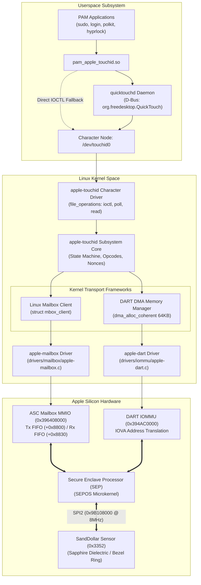
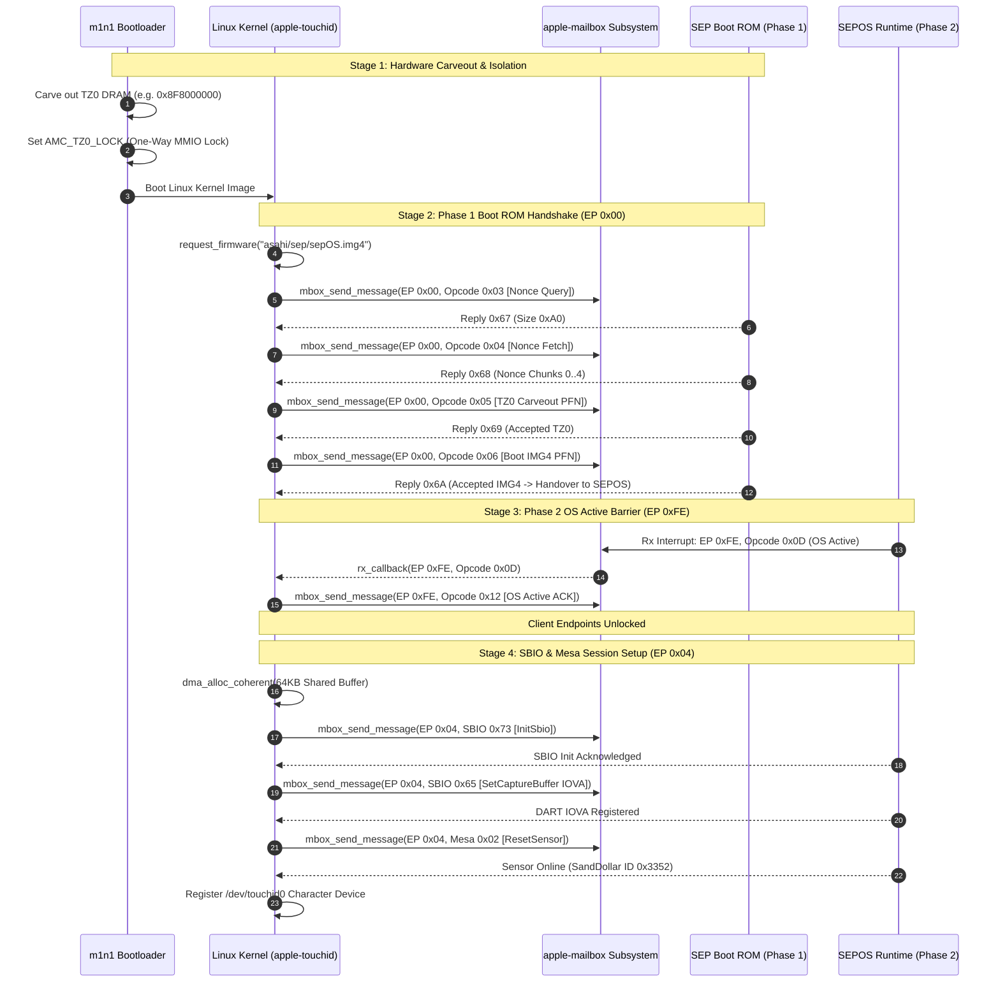
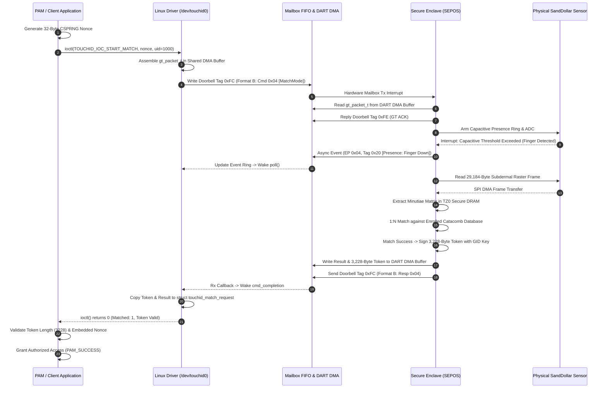

# 05. Linux Implementation Roadmap & Driver Architecture

**Document Identifier:** `ASAHI-SPEC-SEP-005`  
**Subsystem:** Apple Silicon Secure Enclave Processor (SEP) & Biometric Touch ID Subsystem  
**Target Platform:** Apple Silicon SoCs (T8103 M1, T6000 M1 Pro/Max, T6020 M2 Pro/Max, T6030 M3 Pro, T6040 M4)  
**Classification:** Asahi Linux Technical Specification & Clean-Room Architecture Blueprint  
**Status:** Pristine Protocol Specification / Implementation Reference  

---

## Table of Contents

1. [Asahi Clean-Room Compliance Statement](#1-asahi-clean-room-compliance-statement)
   - [1.1 Clean-Room Separation Boundaries](#11-clean-room-separation-boundaries)
   - [1.2 Decompilation Verification & Derivation Ledger](#12-decompilation-verification--derivation-ledger)
2. [Bootloader (`m1n1`) Hardware Handoff & Memory Isolation](#2-bootloader-m1n1-hardware-handoff--memory-isolation)
   - [2.1 TZ0 Secure DRAM Carveout Topology](#21-tz0-secure-dram-carveout-topology)
   - [2.2 One-Way AMC MMIO Register Locking Protocol](#22-one-way-amc-mmio-register-locking-protocol)
3. [Firmware Provisioning & Packaging Lifecycle](#3-firmware-provisioning--packaging-lifecycle)
   - [3.1 Extraction via `asahi-fwextract`](#31-extraction-via-asahi-fwextract)
   - [3.2 Target Directory Packaging Structure](#32-target-directory-packaging-structure)
   - [3.3 Kernel Loading Mechanism (`request_firmware`)](#33-kernel-loading-mechanism-request_firmware)
4. [Low-Level Hardware Mailbox Wire Protocol](#4-low-level-hardware-mailbox-wire-protocol)
   - [4.1 Dual-Register FIFO Physical Layout](#41-dual-register-fifo-physical-layout)
   - [4.2 Framing Format A: Boot & Control (EP `0x00`, EP `0xFE`)](#42-framing-format-a-boot--control-ep-0x00-ep-0xfe)
   - [4.3 Framing Format B: Client Endpoints & GenericTransfer (EP `0x04`)](#43-framing-format-b-client-endpoints--generictransfer-ep-0x04)
5. [SEP Boot Sequence & Memory Transition Mechanics](#5-sep-boot-sequence--memory-transition-mechanics)
   - [5.1 10-Step Boot ROM Protocol Ledger (Endpoint `0x00`)](#51-10-step-boot-rom-protocol-ledger-endpoint-0x00)
   - [5.2 Phase 1 vs. Phase 2 Memory Address Translation](#52-phase-1-vs-phase-2-memory-address-translation)
   - [5.3 Endpoint `0xFE` Control Channel & OS Active Barrier](#53-endpoint-0xfe-control-channel--os-active-barrier)
6. [Safe Linux Kernel Driver Architecture (`apple-touchid`)](#6-safe-linux-kernel-driver-architecture-apple-touchid)
   - [6.1 Linux Mailbox Framework Integration (`apple-mailbox`)](#61-linux-mailbox-framework-integration-apple-mailbox)
   - [6.2 DART IOMMU DMA Allocation & Shared Buffer Management](#62-dart-iommu-dma-allocation--shared-buffer-management)
   - [6.3 `AppleSEPGenericTransfer` Packet Wire Mechanics](#63-applesepgenerictransfer-packet-wire-mechanics)
   - [6.4 Two-Tier Encapsulation: SBIO Transport vs. Mesa Biometrics](#64-two-tier-encapsulation-sbio-transport-vs-mesa-biometrics)
7. [User-Space Character Device Interface (`/dev/touchid0`)](#7-user-space-character-device-interface-devtouchid0)
   - [7.1 Character Device Node & Udev Rules](#71-character-device-node--udev-rules)
   - [7.2 UAPI Struct Definitions & IOCTL Dispatch Ledger](#72-uapi-struct-definitions--ioctl-dispatch-ledger)
   - [7.3 Asynchronous Interrupt Event Ring Buffer](#73-asynchronous-interrupt-event-ring-buffer)
   - [7.4 Nonce Challenge-Response Protocol & Match Token Verification](#74-nonce-challenge-response-protocol--match-token-verification)
8. [High-Level Integration: Daemons & PAM Architecture](#8-high-level-integration-daemons--pam-architecture)
   - [8.1 `quicktouchd` Biometric Service Architecture](#81-quicktouchd-biometric-service-architecture)
   - [8.2 Linux PAM Module Workflow (`pam_apple_touchid`)](#82-linux-pam-module-workflow-pam_apple_touchid)
   - [8.3 Zero Biometric Data Leakage Guarantee](#83-zero-biometric-data-leakage-guarantee)
9. [Comprehensive Architectural Diagrams](#9-comprehensive-architectural-diagrams)

---

## 1. Asahi Clean-Room Compliance Statement

### 1.1 Clean-Room Separation Boundaries

This specification follows the **Asahi Linux Clean-Room Reverse Engineering Policy**. To protect copyright boundaries and ensure GPL licensing compliance for upstream Linux kernel inclusion, we enforce the following separation:

```
┌──────────────────────────────────────────────────────────────────────────────────┐
│                             CLEAN-ROOM SEPARATION MODEL                          │
├────────────────────────────────────────┬─────────────────────────────────────────┤
│         DIRTY ROOM (Analysis)          │          CLEAN ROOM (Implementation)    │
├────────────────────────────────────────┼─────────────────────────────────────────┤
│ • Analyzes macOS kernel caches         │ • Reads ONLY this Protocol Specification│
│   (/tmp/kernel.kc) & hardware traces.  │ • Implements GPL-2.0 Linux kernel driver│
│ • Reverse-engineers MMIO semantics,    │ • Implements userspace daemons (UAPI)   │
│   opcodes, and protocol timings.       │ • Implements PAM modules & integrations │
│ • Disallows outputting raw assembly,   │ • Zero exposure to proprietary code,    │
│   binary hex dumps, or Apple C++ code. │   decompiled C++, or binary artifacts.  │
└────────────────────────────────────────┴─────────────────────────────────────────┘
```

1. **Specification Interface**: This document serves as the sole functional interface contract between reverse-engineering analysis and downstream driver development.
2. **No Proprietary Code**: This document contains no raw ARM64 machine instructions, hex dumps of macOS proprietary binaries, or decompiled C++ class hierarchies.
3. **Standard Representations**: All reverse-engineered concepts use standard C data structures, behavioral pseudocode, timing specifications, register bitfield layouts, and finite state machines (FSMs).

### 1.2 Decompilation Verification & Derivation Ledger

To ensure functional correctness while maintaining clean-room standards, all behavioral models were derived from and verified against the macOS 14.x release kernel cache (`kernel.kc`, build `mac14j`). The verified derivation anchors include:

| Kernel Symbol Anchor | Virtual Address (`kernel.kc`) | Derived Behavioral Rule & Semantic Constraint |
| :--- | :--- | :--- |
| `AppleASCWrapV4::_inbox` | `0xfffffe0008cc6334` | MMIO FIFO dual-register write sequence to Tx FIFO base `+0x8800` via 128-bit store (`stp`). |
| `AppleSEPBooter::bootSEP` | `0xfffffe00099bb89c` | 10-step Boot ROM handshake, strict 4KB physical PFN alignment validation (`tst x0, #0xfff`). |
| `AppleSEPControl::_cmsgAction` | `0xfffffe00099cca5c` | OS Active barrier handling (`0x0D` notification from SEPOS, `0x12` ACK from host AP). |
| `AppleSEPBooter::_timebaseUpdate`| `0xfffffe00099bb388` | Mach absolute timebase continuous synchronization dispatch over Endpoint `0xFE`. |
| `AppleMesaSEPDriver::initSbio` | `0xfffffe00097be784` | SBIO initialization sequence over EP `0x04` with Tag `0x73` (4-byte payload). |
| `AppleMesaSEPDriver::loadPatch` | `0xfffffe00097b1e58` | Sensor microcode patch upload via SBIO Opcode `0x5F` (or `0x5E`). |
| `AppleMesaSEPDriver::establishDH`| `0xfffffe00097b68c8` | Sensor on-die AES-GCM session key setup (DH Host Key `0x43`, DH Sensor Key `0x44`). |
| `AppleSEPGenericTransfer::send` | `0xfffffe00099b5078` | 28-byte `gt_packet_t` header framing, chunking state machine, and doorbell tagging (`0xFC`/`0xFD`/`0xFE`). |
| `IOBioSEPSharedBuffer::init` | `0xfffffe00097be920` | DART IOMMU shared memory registration via SBIO Opcode `0x65` (`SetCaptureBuffer`). |

---

## 2. Bootloader (`m1n1`) Hardware Handoff & Memory Isolation

### 2.1 TZ0 Secure DRAM Carveout Topology

The Secure Enclave Processor operates out of a physically isolated slice of system DRAM called **TZ0 (TrustZone Region 0)**.

```
0x800000000 ┌──────────────────────────────────────────────────────────┐
            │ Application Processor (AP) Linux System Memory           │
            │ (Managed by Linux Kernel Page Tables & DART IOMMU)       │
0x8F8000000 ├──────────────────────────────────────────────────────────┤ ◄── 4KB Page Aligned
            │ TZ0 Secure Enclave DRAM Carveout (e.g., 64 MB / 128 MB) │
            │ • SEPOS Microkernel Code & Working Stacks                │
            │ • Hardware Anti-Replay Tree (xART) Local State           │
            │ • Capacitive Fingerprint Raster Frame (29,184 Bytes)     │
            │ • Minutiae Extraction Matrix & Catacomb Enclave Memory   │
0x900000000 └──────────────────────────────────────────────────────────┘
```

* **Physical Memory Properties**: TZ0 memory is strictly non-cacheable and inaccessible to the Application Processor once secured.
* **Size & Placement**: Typically allocated at the high boundary of DRAM (64 MB on base SoCs, up to 128 MB on Max/Ultra configurations), aligned to a 4KB page boundary.
* **Biometric Isolation**: Raw sensor raster frames (29,184 bytes) and extracted minutiae templates are decoded and matched *exclusively* within TZ0 DRAM.

### 2.2 One-Way AMC MMIO Register Locking Protocol

The Apple Memory Controller (AMC / AMCC) enforces hardware-level bus isolation for TZ0. The `m1n1` bootloader (Stage 1/2) must configure and permanently lock the AMC TZ0 protection registers before starting the Linux kernel.

```c
/* Behavioral Pseudocode: m1n1 AMC TZ0 Protection Configuration */
#define AMC_TZ0_BASE_ADDR_REG     0x200100200ULL
#define AMC_TZ0_END_ADDR_REG      0x200100208ULL
#define AMC_TZ0_LOCK_REG          0x200100210ULL

#define AMC_TZ0_LOCK_ENABLE_BIT   (1U << 0)
#define AMC_TZ0_LOCK_ONEWAY_BIT   (1U << 31)

void m1n1_lock_tz0_carveout(uint64_t phys_start, uint64_t phys_end)
{
    /* Step 1: Program the carveout boundary registers (PFNs) */
    mmio_write64(AMC_TZ0_BASE_ADDR_REG, phys_start >> 12);
    mmio_write64(AMC_TZ0_END_ADDR_REG,   phys_end >> 12);

    /* Step 2: Commit one-way hardware lock */
    mmio_write32(AMC_TZ0_LOCK_REG, AMC_TZ0_LOCK_ENABLE_BIT | AMC_TZ0_LOCK_ONEWAY_BIT);

    /* Flush memory controller pipelines */
    dsb_sy();
    isb();
}
```

> [!IMPORTANT]
> The `AMC_TZ0_LOCK_ONEWAY_BIT` is an irrevocable hardware latch. Once set, the AMC hardware blocks all AP CPU and DMA access to the address range `[phys_start, phys_end]`. Any AP access attempts trigger an immediate System Error (`SError`) abort.

---

## 3. Firmware Provisioning & Packaging Lifecycle

### 3.1 Extraction via `asahi-fwextract`

The Secure Enclave firmware image (`sepOS.img4`) is signed by Apple's production root key and encrypted with a hardware-fused Enclave GID key. Neither `m1n1` nor Linux needs to decrypt this blob; the SEP Boot ROM decrypts and verifies the image internally during boot.

```
┌──────────────────────────────────────────────┐
│ macOS APFS Staging Partition / Recovery OS   │
│ Path: /usr/standalone/firmware/sepOS.img4    │
└──────────────────────┬───────────────────────┘
                       │
                       ▼ asahi-fwextract (Python User-Space Utility)
┌──────────────────────────────────────────────┐
│ Extracted Vendor Blobs (/lib/firmware/asahi/)│
│ ├─ sepOS.img4          (SEPOS Encrypted Exec)│
│ ├─ sep-patches.bin     (SRAM Hardware Patch) │
│ ├─ tmm-manifest.bin    (Trusted Memory Map)  │
│ └─ mesa-patch.bin      (SandDollar Microcode)│
└──────────────────────────────────────────────┘
```

### 3.2 Target Directory Packaging Structure

Firmware files must be placed in standard system firmware search paths:

```
/lib/firmware/asahi/
├── sep/
│   ├── sepOS.img4            # Main SEP firmware container (IMG4)
│   ├── tmm-manifest.bin      # Trusted Memory Manager Manifest
│   └── sep-patches.bin       # Early boot ROM hardware patches
└── mesa/
    ├── sanddollar_patch.bin  # Capacitive sensor on-die SRAM patch (Patch Level 22)
    └── mcal_defaults.bin     # Fallback FDR calibration baseline
```

### 3.3 Kernel Loading Mechanism (`request_firmware`)

The Linux driver loads firmware blobs into DMA-accessible buffers using the standard kernel firmware subsystem:

```c
struct touchid_fw_blobs {
    const struct firmware *sepos_fw;
    const struct firmware *tmm_fw;
    const struct firmware *patches_fw;
    const struct firmware *sensor_patch_fw;
};

static int touchid_load_firmware_blobs(struct device *dev, struct touchid_fw_blobs *blobs)
{
    int ret;

    /* Load encrypted SEPOS IMG4 */
    ret = request_firmware(&blobs->sepos_fw, "asahi/sep/sepOS.img4", dev);
    if (ret) {
        dev_err(dev, "Failed to load asahi/sep/sepOS.img4: %d\n", ret);
        return ret;
    }

    /* Load TMM Manifest */
    ret = request_firmware(&blobs->tmm_fw, "asahi/sep/tmm-manifest.bin", dev);
    if (ret) {
        dev_err(dev, "Failed to load asahi/sep/tmm-manifest.bin: %d\n", ret);
        release_firmware(blobs->sepos_fw);
        return ret;
    }

    /* Load Early Boot ROM Patches */
    ret = request_firmware(&blobs->patches_fw, "asahi/sep/sep-patches.bin", dev);
    if (ret) {
        dev_err(dev, "Failed to load asahi/sep/sep-patches.bin: %d\n", ret);
        release_firmware(blobs->tmm_fw);
        release_firmware(blobs->sepos_fw);
        return ret;
    }

    /* Load Sensor On-Die Microcode Patch (Optional / Fallback to ROM) */
    ret = request_firmware_direct(&blobs->sensor_patch_fw, "asahi/mesa/sanddollar_patch.bin", dev);
    if (ret) {
        dev_warn(dev, "Sensor patch missing; continuing with factory ROM microcode\n");
    }

    return 0;
}
```

---

## 4. Low-Level Hardware Mailbox Wire Protocol

### 4.1 Dual-Register FIFO Physical Layout

Communication with the SEP Mailbox hardware (`apple,asc-mailbox-v4`) uses two registers: `msg0` (64-bit data/command) and `msg1` (32-bit endpoint routing).

```
                      ASC MAILBOX APERTURE (0x396408000)
Tx FIFO (+0x8800):
 63                                                           0
┌──────────────────────────────────────────────────────────────┐
│                            msg0                              │ ◄── 64-Bit Payload / Opcode / Tag / Seq
└──────────────────────────────────────────────────────────────┘
 31                            8 7                            0
┌───────────────────────────────┬──────────────────────────────┐
│        Subsystem Flags        │          Endpoint ID         │ ◄── msg1 (32-Bit)
└───────────────────────────────┴──────────────────────────────┘

Rx FIFO (+0x8830):
 63                                                           0
┌──────────────────────────────────────────────────────────────┐
│                            msg0                              │ ◄── 64-Bit Response / Return Code / Seq
└──────────────────────────────────────────────────────────────┘
 31                            8 7                            0
┌───────────────────────────────┬──────────────────────────────┐
│        Subsystem Flags        │          Endpoint ID         │ ◄── msg1 (32-Bit)
└───────────────────────────────┴──────────────────────────────┘
```

```c
/* Upstream Linux Mailbox Message Definition */
struct apple_mbox_msg {
    u64 msg0; /* Command, payload, chunk parameter, tag, sequence */
    u32 msg1; /* Low 8 bits: Target Endpoint ID; High 24 bits: routing flags */
};
```

> [!WARNING]
> Never pack the Endpoint ID into bits `[7:0]` of `msg0`. The hardware mailbox IP reads the endpoint exclusively from register `msg1`.

### 4.2 Framing Format A: Boot & Control (EP `0x00`, EP `0xFE`)

Format A is used by early Boot ROM sequences (Endpoint `0x00`) and the persistent control channel (Endpoint `0xFE`).

```
msg0 Bitfield Layout (Format A):
 63                          32 31          24 23          16 15           8 7             0
┌──────────────────────────────┬──────────────┬──────────────┬──────────────┬──────────────┐
│         Payload / PFN        │  Param/Chunk │    Opcode    │     Tag      │   Reserved   │
│           [32 bits]          │   [8 bits]   │   [8 bits]   │   [8 bits]   │   [8 bits]   │
└──────────────────────────────┴──────────────┴──────────────┴──────────────┴──────────────┘
msg1: [31:8] Reserved / Flags (0x000000), [7:0] Endpoint (0x00 or 0xFE)
```

```c
#define FORMAT_A_MSG(pfn, param, opcode, tag) \
    ((((u64)(pfn)    & 0xFFFFFFFFULL) << 32) | \
     (((u64)(param)  & 0xFFULL)       << 24) | \
     (((u64)(opcode) & 0xFFULL)       << 16) | \
     (((u64)(tag)    & 0xFFULL)       << 8))
```

### 4.3 Framing Format B: Client Endpoints & GenericTransfer (EP `0x04`)

Format B is used by high-level client subsystems, such as Touch ID (`'mesa'`, Endpoint `0x04`), KeyStore (`'keyb'`), and HDCP (`'hdcp'`).

```
msg0 Bitfield Layout (Format B):
 63                          48 47          32 31          16 15           8 7             0
┌──────────────────────────────┬──────────────┬──────────────┬──────────────┬──────────────┐
│       Sequence Number        │ Flags / High │ Command /    │ Packet Tag / │   Reserved   │
│          [16 bits]           │  [16 bits]   │ Opcode (16b) │  Type (8b)   │   [8 bits]   │
└──────────────────────────────┴──────────────┴──────────────┴──────────────┴──────────────┘
msg1: [31:8] Subsystem Routing (0x000000), [7:0] Endpoint (0x04)
```

```c
#define FORMAT_B_MSG(seq, flags, cmd, tag) \
    ((((u64)(seq)   & 0xFFFFULL) << 48) | \
     (((u64)(flags) & 0xFFFFULL) << 32) | \
     (((u64)(cmd)   & 0xFFFFULL) << 16) | \
     (((u64)(tag)   & 0xFFULL)   << 8))
```

---

## 5. SEP Boot Sequence & Memory Transition Mechanics

### 5.1 10-Step Boot ROM Protocol Ledger (Endpoint `0x00`)

The AP bootstraps the SEP Boot ROM through a synchronous 10-step handshake over Endpoint `0x00` (`msg1 = 0x00000000`).

| Step | Operation | AP Opcode (Sent) | SEP Reply (Received) | Format & Expected Response Payload |
| :---: | :--- | :---: | :---: | :--- |
| **1** | **Nonce Size Query** | `0x03` | `0x67` | Returns size `0xA0` (160 bits / 20 bytes). |
| **2** | **Nonce Fetch** | `0x04` | `0x68` | Chunks 0..4 (20 bytes total anti-replay nonce). |
| **3** | **KCV Digest Query** | `0x1E` | `0x82` | iBIC presence validation flag. |
| **4** | **KCV Fetch** | `0x1F` | `0x83` | Chunks 0..7 (32-byte SHA-256 Key Confirmation Value). |
| **5** | **TMM Manifest** | `0x24` | `0x88` | PFN of Trusted Memory Manager manifest; reply indicates acceptance. |
| **6** | **Patches** | `0x25` | `0x89` | PFN of ROM patch container; reply indicates patch committed. |
| **7** | **Status Check 1** | `0x02` | `0x66` | Verification query: Data payload **MUST equal `1`** (Ready). |
| **8** | **TZ0 Carveout** | `0x05` | `0x69` | PFN of locked TZ0 DRAM carveout; reply confirms acceptance. |
| **9** | **Status Check 2** | `0x02` | `0x66` | Verification query: Data payload **MUST equal `2`** (Carveout Registered). |
| **10**| **Boot IMG4 (Cold)**| `0x06` | `0x6A` | PFN of `sepOS.img4`; triggers ROM signature verify & SEPOS boot. |

### 5.2 Phase 1 vs. Phase 2 Memory Address Translation

```
Phase 1: Boot ROM Sequence (DART Bypassed)
┌─────────────────────────┐          Physical PFN          ┌─────────────────────────┐
│ Linux Kernel (AP)       │ ─────────────────────────────► │ SEP Boot ROM            │
│ phys_addr >> 12         │    (Strict 4KB Alignment)      │ (Direct DRAM Access)    │
└─────────────────────────┘                                └─────────────────────────┘

Phase 2: SEPOS Runtime & Mesa (DART IOMMU Engaged)
┌─────────────────────────┐           IOVA PFN             ┌─────────────────────────┐
│ Linux Kernel (AP)       │ ─────────────────────────────► │ DART IOMMU / SEPOS      │
│ dma_handle >> 12        │     (DART Page Tables Active)  │ (Virtual DMA Access)    │
└─────────────────────────┘                                └─────────────────────────┘
```

1. **Phase 1 (Boot ROM / EP `0x00`)**: The hardware DART IOMMU is bypassed. The AP must transmit **True Physical Page Frame Numbers (PFNs)** calculated as `virt_to_phys(buffer) >> 12`. All buffers must be strictly 4KB aligned.
2. **Phase 2 (OS Active / Client Endpoints)**: Once SEPOS completes initialization, DART is engaged. All subsequent transactions must transmit **IOVA PFNs** obtained from `dma_alloc_coherent()`.

### 5.3 Endpoint `0xFE` Control Channel & OS Active Barrier

Endpoint `0xFE` is a persistent control channel operating under Format A framing.

```
Host (AP Linux)                                                Secure Enclave (SEP)
       │                                                                │
       │ ◄═══════════ 1. Opcode 0x0D: "OS Active Notification" ═════════│ (SEPOS Boot Complete)
       │                                                                │
       │ ════════════ 2. Opcode 0x12: "OS Active ACK" ════════════════► │ (AP Handshake Reply)
       │                                                                │
 [ Client Endpoints (0x04 'mesa') Unlocked by SEP Hardware State Machine ]
       │                                                                │
       │ ════════════ 3. Timebase Sync: Mach Absolute Time ═══════════► │ (Periodic anti-replay)
       │                                                                │
       │ ════════════ 4. Power State: Sleep (0x0E) / Wake (0x0F) ═════► │ (PM transitions)
```

> [!CRITICAL]
> The driver **must not dispatch commands to Endpoint `0x04`** until the `0x0D` / `0x12` OS Active barrier exchange has completed on Endpoint `0xFE`. Early messages to client endpoints will be silently dropped or trigger ASC mailbox stalls.

---

## 6. Safe Linux Kernel Driver Architecture (`apple-touchid`)

### 6.1 Linux Mailbox Framework Integration (`apple-mailbox`)

Direct MMIO writes to `0x396408800` bypass the kernel's lock management, causing race conditions with `drivers/mailbox/apple-mailbox.c` and triggering fatal `SError` bus panics. The driver must interface strictly through the Linux Mailbox framework.

```c
/* Device Tree Node Definition */
/*
touchid: touchid@0 {
    compatible = "apple,touchid", "apple,sanddollar";
    mboxes = <&sep_mailbox 0>;
    mbox-names = "sep";
    iommus = <&sep_dart 0>;
    status = "okay";
};
*/

struct touchid_driver_data {
    struct device *dev;
    struct mbox_client mbox_cl;
    struct mbox_chan *mbox_chan;
    struct completion cmd_completion;
    struct apple_mbox_msg last_rx_msg;
    
    /* DMA Shared Memory */
    void *dma_vaddr;
    dma_addr_t dma_iova;
    size_t dma_size;
    
    /* State Tracking */
    bool os_active_passed;
    bool sbio_initialized;
    uint16_t sequence_num;
    struct mutex lock;
};

/* Mailbox Asynchronous Rx Callback */
static void touchid_mbox_rx_callback(struct mbox_client *cl, void *mssg)
{
    struct touchid_driver_data *drv = dev_get_drvdata(cl->dev);
    struct apple_mbox_msg *msg = (struct apple_mbox_msg *)mssg;

    u8 ep = msg->msg1 & 0xFF;
    u8 tag = (msg->msg0 >> 8) & 0xFF;

    dev_dbg(drv->dev, "RX EP:0x%02x Tag:0x%02x Msg0:0x%016llx\n", ep, tag, msg->msg0);

    /* Handle OS Active Notification on EP 0xFE */
    if (ep == 0xFE && ((msg->msg0 >> 16) & 0xFF) == 0x0D) {
        drv->os_active_passed = true;
        /* Send ACK 0x12 */
        struct apple_mbox_msg ack_msg = {
            .msg0 = FORMAT_A_MSG(0, 0, 0x12, 0x01),
            .msg1 = 0xFE,
        };
        mbox_send_message(drv->mbox_chan, &ack_msg);
        return;
    }

    /* Client Endpoint Message Routing */
    drv->last_rx_msg = *msg;
    complete(&drv->cmd_completion);
}
```

### 6.2 DART IOMMU DMA Allocation & Shared Buffer Management

```c
static int touchid_allocate_dma_pool(struct touchid_driver_data *drv)
{
    drv->dma_size = 64 * 1024; /* 64 KB Shared Transaction Window */
    drv->dma_vaddr = dma_alloc_coherent(drv->dev, drv->dma_size, &drv->dma_iova, GFP_KERNEL);
    if (!drv->dma_vaddr) {
        dev_err(drv->dev, "Failed to allocate 64KB DART DMA coherent buffer\n");
        return -ENOMEM;
    }

    dev_info(drv->dev, "Allocated DART DMA Buffer: VAddr=%p, IOVA=0x%pad\n",
             drv->dma_vaddr, &drv->dma_iova);
    return 0;
}
```

### 6.3 `AppleSEPGenericTransfer` Packet Wire Mechanics

Large payloads exchanged over Endpoint `0x04` utilize a 28-byte header (`struct gt_packet_header`) in the shared DMA buffer:

```c
struct gt_packet_header {
    __le32 version;     /* Protocol version: must equal 1 (kGTVersion) */
    __le32 total_size;  /* Total transaction payload size in bytes */
    __le32 offset;      /* Byte offset of payload in current chunk */
    __le32 flags;       /* Buffer flags: 0x02 = static buffer, 0x04 = anti-replay */
    __le32 result;      /* Return status code: 0 = success */
    __le32 command;     /* Command ID matching mailbox command field */
    __le32 data_size;   /* Byte count of payload chunk in this packet */
    __u8   payload[];   /* Variable length payload data */
} __packed;

#define GT_TAG_FIRST  0xFC /* Out-of-line First Packet */
#define GT_TAG_NEXT   0xFD /* Out-of-line Subsequent Packet */
#define GT_TAG_ACK    0xFE /* Out-of-line Transaction Acknowledge */
#define GT_TAG_ERROR  0xFF /* Out-of-line Transaction Abort/Error */
```

### 6.4 Two-Tier Encapsulation: SBIO Transport vs. Mesa Biometrics

Endpoint `0x04` (`'sbio'`) employs a two-tier nested encapsulation model:

1. **Tier 1: Outer SBIO Transport Layer (`0x43`–`0x7D`)**:
   * Carried directly in the `gt_packet_header->command` field dispatched over GenericTransfer.
   * Manages transport activation (`0x73`), microcode patching (`0x5F`), Diffie-Hellman session key exchange (`0x43`/`0x44`), calibration ingestion (`0x5B`), DMA capture buffer registration (`0x65`), and biometric dispatch execution (`0x54` / `kSBIOCommandPerformCommand`).

2. **Tier 2: Inner Mesa Biometric Application Layer (`0x01`–`0x57`)**:
   * Encapsulated **inside the payload** of the outer transport command `0x54` (`kSBIOCommandPerformCommand`).
   * Prefixed by the 8-byte `struct bm_cmd` header (magic `0x4D42` `'BM'`), containing the biometric application opcode (`0x03` EnrollMode, `0x04` MatchMode, `0x26` FingerDetectMode, `0x40` LoadCatacomb, `0x42` GetIdentitiesList, `0x49` ForceBioLockout).

```
+----------------------------------------------------------------------------------------------------+
| 64-Bit Hardware Mailbox: Format B (msg0: cmd=0x0054, tag=0xFC; msg1: ep=0x04)                      |
+----------------------------------------------------------------------------------------------------+
                                                  |
                                                  v
+----------------------------------------------------------------------------------------------------+
| Tier 1 Outer Header: `struct gt_packet_header` (28 bytes, command = 0x54: kSBIOCommandPerformCmd)  |
+----------------------------------------------------------------------------------------------------+
                                                  |
                                                  v
+----------------------------------------------------------------------------------------------------+
| Tier 2 Inner Header: `struct bm_cmd` (8 bytes, magic = 0x4D42, opcode = 0x04: kMesaCommandMatch)   |
| Payload: struct touchid_match_params ...                                                           |
+----------------------------------------------------------------------------------------------------+
```

This nested encapsulation guarantees that overlapping numeric values between outer SBIO transport commands and inner Mesa biometric commands never collide on the wire.

```c
#define BM_CMD_MAGIC 0x4D42 /* BM */
struct bm_cmd {
    __le16 magic;        /* 0x4D42 (BM) */
    __u8   subsystem;    /* Subsystem selector (0x01) */
    __u8   flags;        /* Flags */
    __u8   opcode;       /* Mesa Biometric Opcode (e.g. 0x04 Match, 0x03 Enroll) */
    __u8   reserved;     /* Padding */
    __le16 sequence;     /* Biometric sequence number */
    __le32 payload_len;  /* Parameter payload length */
    __u8   payload[];    /* Command arguments */
} __packed;
```

---

## 7. User-Space Character Device Interface (`/dev/touchid0`)

### 7.1 Character Device Node & Udev Rules

The kernel driver registers a standard character device node under dynamic major allocation:

```udev
# /etc/udev/rules.d/99-apple-touchid.rules
# Restrict direct access to biometric daemon and authorized user sessions
KERNEL=="touchid[0-9]*", SUBSYSTEM=="apple_touchid", GROUP="plugdev", MODE="0660"
```

### 7.2 UAPI Struct Definitions & IOCTL Dispatch Ledger

The public header `<uapi/linux/apple_touchid.h>` defines the user-space ABI:

```c
#ifndef _UAPI_LINUX_APPLE_TOUCHID_H
#define _UAPI_LINUX_APPLE_TOUCHID_H

#include <linux/types.h>
#include <linux/ioctl.h>

#define TOUCHID_DEVICE_NODE          "/dev/touchid0"
#define TOUCHID_CHALLENGE_NONCE_LEN  32
#define TOUCHID_AUTH_TOKEN_LEN       3228
#define TOUCHID_UUID_LEN             16

/* Device Feature Bitmap */
#define TOUCHID_DEV_FLAG_HAS_XART        BIT(0)
#define TOUCHID_DEV_FLAG_SEP_BOOTED      BIT(1)
#define TOUCHID_DEV_FLAG_FDR_CALIBRATED  BIT(2)
#define TOUCHID_DEV_FLAG_HW_AES_ENABLED  BIT(3)
#define TOUCHID_DEV_FLAG_PRESENCE_RING   BIT(4)

/* Match Result Codes */
enum touchid_match_status {
    TOUCHID_MATCH_SUCCESS         = 0,
    TOUCHID_MATCH_NO_MATCH        = 1,
    TOUCHID_MATCH_TIMEOUT         = 2,
    TOUCHID_MATCH_CANCELED        = 3,
    TOUCHID_MATCH_LOCKED_OUT      = 4,
    TOUCHID_MATCH_SENSOR_DIRTY    = 5,
    TOUCHID_MATCH_PARTIAL_PRINT   = 6,
    TOUCHID_MATCH_COMM_ERROR      = 7,
    TOUCHID_MATCH_INTERNAL_ERROR  = 8,
    TOUCHID_MATCH_ERROR_HARDWARE  = 9,
};

/* Device Information Descriptor */
struct touchid_device_info {
    __u16 sensor_id;                 /* 0x3352 for AppleSandDollar */
    __u16 patch_version;             /* On-die microcode revision */
    __u32 hardware_rev;              /* Board revision */
    __u32 spi_clock_hz;              /* 8,000,000 Hz */
    __u32 spi_mode;                  /* Mode 3 (CPOL=1, CPHA=1) */
    __u32 raw_frame_size;            /* 29,184 Bytes */
    __u32 flags;                     /* TOUCHID_DEV_FLAG_* */
    __u32 max_identities;            /* 5 Templates */
    __u32 enrolled_identities;       /* Current count */
    __u8  serial_number[16];         /* Hardware Unique Serial */
    char  model_name[32];            /* "AppleSandDollar" */
    __u32 reserved[6];
} __attribute__((aligned(8)));

/* Biometric Match Request Structure */
struct touchid_match_request {
    __u8  challenge_nonce[TOUCHID_CHALLENGE_NONCE_LEN]; /* In: 256-bit CSPRNG Nonce */
    __u32 uid;                                          /* In: Target System UID */
    __u32 timeout_ms;                                   /* In: Timeout in ms (e.g. 10000) */
    __u32 flags;                                        /* In: Match options */
    __u32 reserved;
    
    /* Result Block (Filled by Kernel Driver) */
    struct touchid_match_result {
        __u32 matched;                                  /* 1 = Success, 0 = Fail */
        __u32 uid;                                      /* Matched UID */
        __u8  identity_uuid[TOUCHID_UUID_LEN];          /* Enrolled Template UUID */
        __u64 timestamp;                                /* SEPOS Monotonic Timestamp */
        __u32 token_len;                                /* Valid byte count (3228) */
        __s32 result_code;                              /* enum touchid_match_status */
        __u8  token[TOUCHID_AUTH_TOKEN_LEN];            /* Cryptographic Proof Token */
        __u32 reserved[4];
    } result;
} __attribute__((aligned(8)));

/* IOCTL Command Ledger */
#define TOUCHID_IOC_MAGIC            'T'
#define TOUCHID_IOC_GET_DEVICE_INFO  _IOR(TOUCHID_IOC_MAGIC,  84, struct touchid_device_info)
#define TOUCHID_IOC_START_MATCH      _IOWR(TOUCHID_IOC_MAGIC,  4, struct touchid_match_request)
#define TOUCHID_IOC_CANCEL           _IO(TOUCHID_IOC_MAGIC,   12)
#define TOUCHID_IOC_CHECK_LOCKOUT    _IOWR(TOUCHID_IOC_MAGIC, 39, struct touchid_lockout_info)

#endif /* _UAPI_LINUX_APPLE_TOUCHID_H */
```

### 7.3 Asynchronous Interrupt Event Ring Buffer

User-space applications can monitor capacitive touch state changes by calling `poll()` or `read()` on `/dev/touchid0`:

```c
struct touchid_event {
    __u32 event_type; /* 1=Finger Down, 2=Finger Up, 3=Capture Start, 4=Match Done */
    __u32 status;     /* Status flags / SNR quality */
    __u64 timestamp;  /* Monotonic timestamp in nanoseconds */
    __u32 reserved[2];
} __attribute__((aligned(8)));
```

### 7.4 Nonce Challenge-Response Protocol & Match Token Verification

```
User-Space (PAM / quicktouchd)                 Kernel Driver                  Secure Enclave (SEP)
             │                                        │                                  │
   1. Generate 256-bit CSPRNG Nonce                   │                                  │
   2. ioctl(TOUCHID_IOC_START_MATCH, nonce) ────────► │                                  │
             │                                        │ 3. Pack Mesa MatchMode Cmd ─────►│
             │                                        │    (Pass Nonce in OOL Buffer)    │
             │                                        │                                  │
             │                                        │                                  │ [User Touches Sapphire Sensor]
             │                                        │                                  │ ├─ Capacitive Scan (29,184 Bytes)
             │                                        │                                  │ ├─ Minutiae Extraction Matrix
             │                                        │                                  │ ├─ 1:N Match vs Catacomb DB
             │                                        │                                  │ └─ Sign Proof with GID Key
             │                                        │                                  │
             │                                        │ ◄── 4. Return 3,228-Byte Token ──│
             │ ◄── 5. Copy Token to User Buffer ──────│
             │
   6. Cryptographic Proof Validation:
      • Token Size == 3,228 Bytes
      • HMAC / AES-GCM Signature Valid
      • Embedded Nonce == Initial Challenge
```

---

## 8. High-Level Integration: Daemons & PAM Architecture

### 8.1 `quicktouchd` Biometric Service Architecture

`quicktouchd` is an unprivileged system daemon that coordinates multi-user session state, template mapping, and UI notifications:

```
┌────────────────────────────────────────────────────────────────────────┐
│                        quicktouchd System Daemon                       │
├────────────────────────────────────────────────────────────────────────┤
│ • D-Bus Interface: org.freedesktop.QuickTouch                          │
│ • SKS Lockout Counter & Anti-Hammering Enforcement                     │
│ • Multi-User System UID to Catacomb UUID Mapping                       │
│ • Desktop Visual Prompts (Wayland / Hyprland / GNOME OSD)              │
│ • Fallback to Password Authentication on Consecutive Failures          │
└──────────────────────────────────┬─────────────────────────────────────┘
                                   │ ioctl()
                                   ▼
                       /dev/touchid0 Device Node
```

### 8.2 Linux PAM Module Workflow (`pam_apple_touchid`)

```c
/* PAM Authentication Entry Point (Behavioral Pseudocode) */
PAM_EXTERN int pam_sm_authenticate(pam_handle_t *pamh, int flags, int argc, const char **argv)
{
    int fd, ret;
    struct touchid_match_request req = {0};
    const char *username;

    pam_get_user(pamh, &username, NULL);
    struct passwd *pw = getpwnam(username);
    if (!pw)
        return PAM_USER_UNKNOWN;

    fd = open("/dev/touchid0", O_RDWR | O_CLOEXEC);
    if (fd < 0)
        return PAM_AUTHINFO_UNAVAIL;

    /* Generate Cryptographic Challenge Nonce */
    getrandom(req.challenge_nonce, sizeof(req.challenge_nonce), GRND_NONCE);
    req.uid = pw->pw_uid;
    req.timeout_ms = 10000; /* 10-second prompt timeout */

    /* Prompt User */
    pam_info(pamh, "Touch ID: Place finger on sensor...");

    ret = ioctl(fd, TOUCHID_IOC_START_MATCH, &req);
    close(fd);

    if (ret == 0 && req.result.matched == 1 && req.result.token_len == TOUCHID_AUTH_TOKEN_LEN) {
        /* Sanitize sensitive stack buffers */
        explicit_bzero(&req, sizeof(req));
        return PAM_SUCCESS;
    }

    explicit_bzero(&req, sizeof(req));
    return PAM_AUTH_ERR;
}
```

### 8.3 Zero Biometric Data Leakage Guarantee

1. **No Image Exposure**: Neither the Linux kernel driver nor any user-space process can ever access raw capacitive fingerprint imagery. The hardware SPI controller is wired directly to the SEP.
2. **Template Security**: Enrolled minutiae templates reside encrypted in SEP NVRAM (Catacomb), protected by on-chip hardware anti-replay trees (xART).
3. **Deterministic Tokens**: Linux receives only an ephemeral, cryptographically signed assertion of authentication (`struct touchid_match_result`).

---

## 9. Comprehensive Architectural Diagrams

### 9.1 Linux Kernel Driver Stack Architecture



### 9.2 Probe, Boot, and Initialization Sequence



### 9.3 Runtime Biometric Transaction Sequence



---

## Conclusion & Implementation Summary

This specification provides the technical reference for building an in-tree or out-of-tree Linux kernel driver for Apple Silicon Touch ID:

1. **Clean-Room Separation**: Clear boundaries between reverse-engineering analysis and driver implementation.
2. **Accurate Hardware Framing**: Correct use of dual-register mailbox writes (`msg0` and `msg1`) without single-word packing bugs.
3. **Safe Memory Management**: Clean transition from Phase 1 physical PFNs to Phase 2 DART IOVAs, with one-way `m1n1` AMC TZ0 hardware locking.
4. **Standard Subsystem Integration**: Full compatibility with the Linux Mailbox framework (`struct mbox_client`), character device APIs, and PAM authentication.
